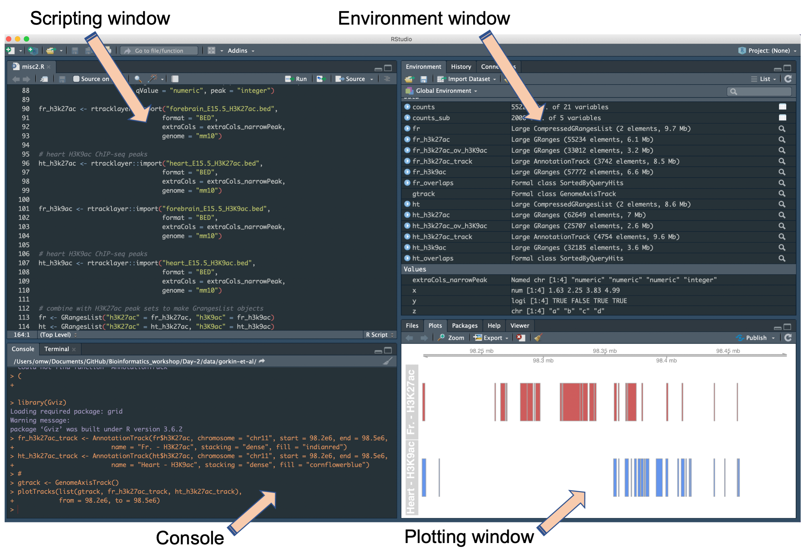

# Introduction to R

------------------------------

### Learning objectives:
- Learn how to use R studio efficiently
- Learn the basic syntax of the R programming language
- Learn the basic data structures used in R

------------------------------

R is a free, open source programming language and statistical software environment that is used extensively in bioinformatics. Beyond the basic functionality included in R's standard distribution, an enormous number of packages designed to extend R's functionality for specific applications an exist, representing one of R's core strengths.

R is also a very powerful way to create high quality graphics, using both functionality in base R as well as graphics specific packages, such as [ggplot2](https://ggplot2.tidyverse.org/). These packages provide a high level of user control, meaning almost all plotting features can be controlled. Importantly, numerous R packages provide functionality for generating bioinformatics specific visualizations.

Visit the *R-Project* homepage [here](https://www.r-project.org/).


> **Note:** This is not a comprehensive introduction to R-programming, but rather a review of the basics to help get you started. In addition to the materials provided to you before the workshop, there are some links to more comprehensive tutorials for R in the 'cheat-sheets.md' in the parent directory of the workshop repository.

R is generally considered a *functional programming language*. Without going into detail, this essentially means that the way in which R performs tasks and solves problems is centered around **functions**.

**Functions** are specific pieces of code that take a defined input, perform an operation or series of operations on the input, and return an output, again in a defined format.

In R, the basic syntax of a function is as follows:
`name.of.function(argument.1 = value, argument.2 = value, ...)`

For example, the `print()` function will print the argument(s) provided to it as input to the R console as outputs. In the below code chunk, the inputs 1,2,3 are being provided to the `print()` function as inputs via its first 3 arguments.

```r
print(1, 2, 3)
```

Manual/help pages for a specific function can be obtained using `?`. To bring up the manual page for the `print()` function:
```r
?print()
```

## How do we use R?

There are several ways we can interface with R, including:

- the basic user interface
- running directly from a terminal-type application
- using a graphical user interface (GUI) or Integrated Development Environment (IDE)

While there are times when it is preferable to run R in one way over another, using a GUI or IDE is perhaps the most popular what to interface with R, with the most popular IDE being *RStudio*.

### RStudio

[RStudio](https://rstudio.com/) is an IDE (Integrated Development Environment). An IDE is software built to consolidate different aspects of writing, executing, and evaluating computer code. Without an IDE, these aspects of programming would need to be performed in different applications, potentially reducing productivity.  


**Basic features of the RStudio IDE include:**  
- console for submitting code to
- syntax-highlighting editor used for writing R-scripts
- windows for environment management, data visualization, and debugging
- facilities for version control & project management




When using RStudio, you will generally want to generate your code using the scripting window first, and then use the options available to submit this code, or segments of it, directly to the console using the buttons at the top of the scripting window (or keyboard shortcuts!).

We will be using RStudio throughout the workshop, although will point out how and when you may wish to run R interactively (such as on an HPC).

---
## Orienting yourself

As with working on the terminal a good first step is to orient yourself, lets see where on your local computer and reset this location to where you want to be with the `getwd()` and `setwd()` commands.

```r
# where are you on your local machine
getwd()

# set working directory to the data folder of Day-2 in the github repo you downloaded - notice that the path needs to be in double quotes
setwd("your_path/Bioinformatics_workshop/Day-2/data/")
```

## Basic data structures in R

Programming in R is achieved by assigning values to *objects*. Objects are specific data structures that take on a particular form defined by that objects *class*. The most fundamental and basic object class in R are *vectors*.

### Vectors

Vectors can only hold one type of data (a property referred to as being *atomic*).In R, five basic object classes exist:  
- numeric - real numbers (e.g. 1.342)
- integer - whole numbers (e.g. 1.0)Â
- character - strings of characters (e.g. letters, words, sentences)
- logical - `TRUE` or `FALSE`
- complex - numbers with 'imaginary' parts (not commonly used)

Vectors can be created using the `c()` function (standing for *combine*), which concatenates its arguments together into a single vector. c() can be used in conjucntion with the assignment operator `<-` which tells R you want to assign that vector to a specific value.
```r
# numeric
x <- c(1.63, 2.25, 3.83, 4.99)

# integer
x <- as.integer(c(1, 2, 3, 4))

# characters
x <- as.character(c("a", "b", "c", "d"))

# logical
x <- c(TRUE, FALSE, TRUE, TRUE)
```

Each object class has specific *attributes*, which we can extract using the appropriate accessor functions. For example, the class of an object is itself an attribute that can be obtained using the `class()` function:
```r
class(x)
```

Another important attribute is length. For example, if we want to know how many elements are in a character string, we can use the `length()` function.
```r
length(x)
```

Vectors can be combined or nested to create a single vector, or evaluated against each other:
```r
# combine a vector and a nested vector
x <- c(1, 2, 3, 4, c(1, 2, 3, 4))
x

# multiply two integer vectors
y <- c(2, 2, 2, 2)
x * y
```

Even though vectors are atomic, they can be coerced from one class to another using functions written to modify their attributes. e.g.
```r
x <- c(1, 2, 3, 4)
as.character(x)

x <- c(TRUE, FALSE, TRUE, TRUE)
as.numeric(x)

x <- c(1.63, 2.25, 3.83, 4.99)
as.integer(x)
```

Elements within vectors can be subset or indexed based on their position in that vector. Individual elements can also be assigned names, which can also be used to perform indexing.
```r
# define a chacter string
x <- c("a", "b", "c", "d")

# get elements 1 and 3
x[c(1,3)]

# get elements 1 to 3 using the ':' operator
x[c(1:3)]

# define a numeric vector
x <- c(1.63, 2.25, 3.83, 4.99)

# assign it names
names(x) <- c("gene 1", "gene 2", "gene 3", "gene 4")

# index for specific element
x["gene 1"]
```

Vectors can contain missing values, defined by `NA` and `NaN`. These elements can be identified with the functions `is.na()` or `is.nan()`:
```r
x <- c(1.63, NA, 3.83, 4.99)
x

x.na <- is.na(x)
x.na

# what object class is returned  
class(x.na)
```

### Operators

We introduced two *operators* in the examples above, the assignment operator `<-` and the sequence operator `:`. Operators are essentially symbols that tell R how you would like to relate the *operands* on either side of the symbol. in R, operators can be broadly categorized into *assignment*, *arithmetic*, *relational*, and *logical*.

The major assignment operators are `<-` and `=` which both tell R to assign a vector to a some value. It is generally safer to use `<-` (in my opinion).

Below are the basic *arithmetic*, *relational*, and *logical* operators that are useful to know.

**Arithmetic operators**

Operator | Effect
----- | -----
\+ | addition
\-	| subtraction
\*	| multiplication
/	| division
^ |	exponentiation

Some example usage of arithmetic operators:
```r
# addition
1 + 2

# multiplication
2 * 3

# exponentiation
2^4
```

**Relational operators**

Operator | Effect
----- | -----
<	| less than
\>	| greater than
<= |	less than or equal to
\>=	| greater than or equal to
== |	equal to
!= |	Not equal to

Some example usage of relational operators:
```r
x <- c(1, 2, 3, 4)

# which elements are less than 3
x < 3

# which elements are less than or equal to 3
x <= 3

# define a character string
x <- c("a", "b", "c", "d", "a")

# which elements are equal to a
x == "a"
```

**Logical operators**

Operator | Effect
----- | -----
!	| NOT
&	| AND
\|	| OR

Some example usage of logical operators:
```r
x <- c(1, 2, 3, 4)

# which elements are NOT equal to 4
x != 4

# which could also be achieved with
!x == 4

# which elements are less than 2 or equal to 4
x < 2 | x ==4

# which elements are less than 2 AND equal to 4
x < 2 & x == 4
```
**Note:** When combining operators, operator precedence applies, such that operators with high precedence will be evaluated first. For example, in the above line, `x < 2` will be evaluated before `x == 4` as the `<` has greater precedence than `==`. You can explore operator precendence in R using the man page returned by `?Syntax`.

Relational and logical operators can be used to subset a vector based on the values returned by the operator, and the brackets, as we did above for specific elements.
```r
x <- c(1, 2, 3, 4)

# subset x for values less than 3
x_sub <- x[x < 3]
x_sub

# define a character string
x <- c("a", "b", "c", "d", "a")

# subset x for elements equal to a
x[x == "a"]
```


### Factors

Factors are a special instance of vectors where only predefined values, called *levels* can be included in the vector. Such vectors are useful when you know that elements of a vector should take on one of those predefined values.

Categorical data is often stored in vectors, making them a very important object class when you start doing any statistical modeling in R. For example, you might store subject gender for all the subjects in your study as a factor, with the levels *male* and *female*.

```r
# make a character vector with only male or female as entries
x <- c("female", "female", "male", "female", "male")

# use factor() constructor function to generate the factor
x <- factor(x, levels = c("female", "male"))

# confirm the class and check the levels
class(x)
levels(x)

# use table() to count up all the instances of each level
table(x)
```

### Lists

Sometimes, it may be desirable to store multiple vectors, or even vectors of different object classes, in the same R overall object. Lists are a special object class that permits objects with these attributes, making them distinct from atomic vectors.

In the same way that vectors and factors are constructed using `c()` and `factors()` respectively, lists are created using the `list()` constructor function.

```r
x <- list(c(1.63, 2.25, 3.83, 4.99),
          c(2.43, 8.31, 3.12, 7.25),
          c(1.29, 3.23, 3.48, 0.23))

# the structure function str() can be useful to examine the composition of a list
str(x)

# confirm the length
length(x)

# lists can be subset using brackets
### subset for first element of list
x[[1]]
### subset for first element of first vector in list
x[[1]][1]

# lists elements can be given names using a character vector equal to list length
names(x) <- c("gene_1", "gene_2", "gene_3")

# names can also be used to subset a list
x[["gene_1"]]

# subsetting can also be achieved with the $ subsetting operator
x$gene_1
```

In our example list, all three vectors stored in the list are numeric, however as mentioned above, lists can store vectors of different classes.


```r
x <- list(c(1.63, 2.25, 3.83, 4.99),
          c(TRUE, FALSE, TRUE, TRUE),
          c("a", "b", "c", "d"))

# use the structure function str()to examine the composition of the list
str(x)
```

### Matrices

By extending the attributes of a vector to give them *dimensions*, i.e. the number of rows and columns we want the vector to be organized into, we can create *matrices*, a data structure that efficiently stores tabular data of a specific, single object class.

```r
mat <- matrix(c(1.63, 2.25, 3.83, 4.99,
                2.43, 8.31, 3.12, 7.25,
                1.29, 3.23, 3.48, 0.23),
                nrow=3, ncol=4)
# check the structure and dimensions with dim()
str(mat)
dim(mat)

# specific elements can be obtained through subsetting
### row 1
mat1[1,]
### column 2
mat1[,2]
### element 2 of row 3
mat[3,2]

# check class of the object and one row
class(mat)
class(mat[1,])
```

Since matrices have dimensions, `names()` cannot be used as we did for vectors. Instead, `names()` is generalized into `rownames()` and `colnames()`.

```r
rownames(mat1) <- c("gene_1", "gene_2", "gene_3")
colnames(mat1) <- c("subject_1", "subject_2", "subject_3")
```

Matrices are a very important object class for mathematical and statistical applications in R, so it is certainly worth exploring more complex matrix operations if you will be doing any more complex statistical analysis in R.

### Data frames

Data frames are very efficient ways of storing tabular data in R. Like matrices, data frames have dimensionality and are organized into rows and columns, however data frames can store vectors of different object classes.

Often you will construct a data frame by reading in a dataset from a file. While we will cover reading data into R below, we will construct a data frame using the `data.frame()` constructor function in R for this example.

```r
df <- data.frame(subject_id = c("s1", "s2", "s3", "s4"),
                 age = c(45, 83, 38, 23),
                 gender = c("female", "female", "male", "female"),
                 status = c("case", "case", "control", "control"))

str(df)
```

Note that the default behavior of `data.frame()` in R version < 4.0 is to convert character strings to factors. If you want to prevent this behavior, you can set the `StringsAsFactors` argument as `FALSE`. In R versions > 4.0, the default behaviour is `StringsAsFactors==TRUE`.

```r
df <- data.frame(subject_id = c("s1", "s2", "s3", "s4"),
                 age = c(45, 83, 38, 23),
                 gender = c("female", "female", "male", "female"),
                 status = c("case", "case", "control", "control"),
                 stringsAsFactors=FALSE)

str(df)
```

Data frames can be subset in similar ways to matrices using brackets or the `$` subsetting operator. Columns/variables can also be added using the `$` operator.
 ```r
# get first row
df[1,]

# get first column
df[,1]

# get gender variable/column
df[, c("gender")]

# # get gender and status
df[, c("gender", "status")]

# get the gender variable with $
df$gender

# add a column for smoking status
df$smoking_status <- c("former", "none", "heavy", "none")
```

Relational (e.g. `==`) and logical operators (e.g. `!`) can be used to interrogate specific variables in a dataframe. The resulting logical can also be used to subset the data frame.
```r
# obtain a logical indicating which subjects are female
df$gender == "female"

# use logical to subset the data frame for only female subjects (rows)
df2 <- df[df$gender == "female", ]

# check dimensions of the new data frame
dim(df2)

# use the LOGICAL NOT operator ! to obtain only male subjects  
df[!df$gender == "female", ]

# this could obviously also be achieved with..
df[df$gender == "male", ]
```
