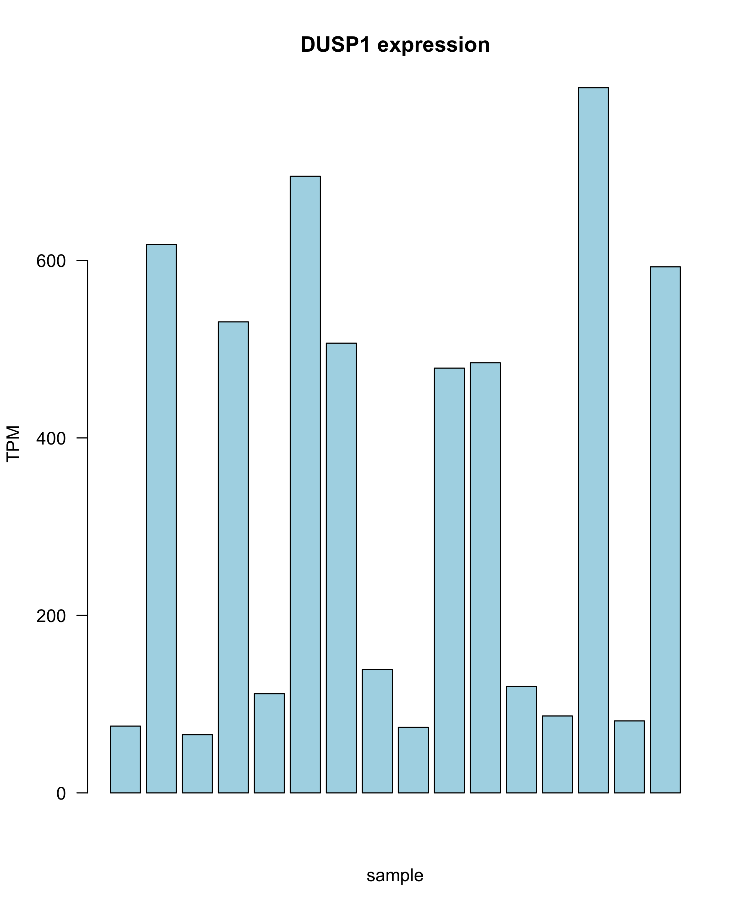
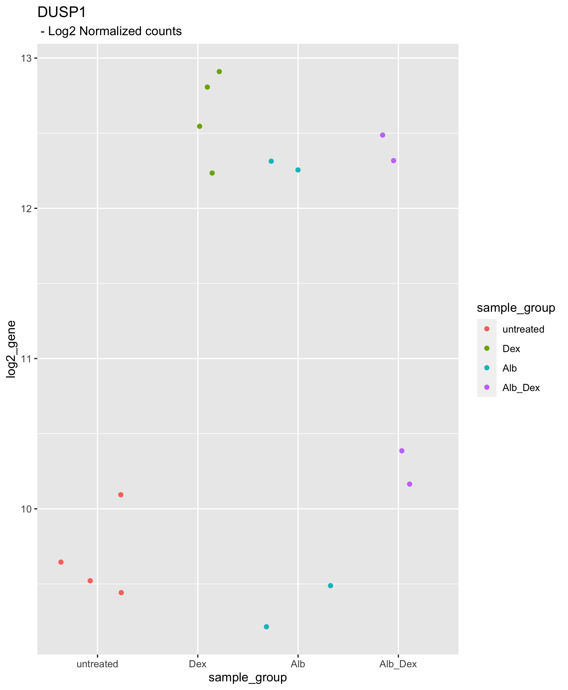

# Part 4 - Data normalization in RNA-seq

### Learning objectives:
- Understand why read counts must be normalized in RNA-seq data
- Learn the principles behind the major normalization strategies in RNA-seq and when to apply them
- Learn how to perform standard normalization strategies

### Set-up

If you started a new R session, you must load in the `DESeq2` object we created in the previous lesson, which contains the counts and sample metadata.

```r
# load in the R object
dds <- readRDS("DESeq2.rds")
```

As we saw in the last lesson, the `counts()` function can be used to extract the matrix of raw read counts from the DESeq2 object:
```r
cts <- counts(dds, normalized=FALSE)
```

These counts will be needed for the normalization exercises below.

You will also need to load some R-packages that will be used in this lesson:
```r
library(ggplot2)
library(tximport)
library(DESeq2)
library(biomaRt)
library(vsn)
library(pheatmap)
```

## Count normalization in RNA-seq

To compare expression levels between genes within a sample, or genes across multiple samples, it is critical the data is normalized to allow appropriate interpretation of the results. Which normalization strategy used depends on several factors such as library type, and type of comparison you wish to make (e.g. within- vs between-sample).

Below we will discuss the major sources of variation that need to be accounted for during normalization in order to reach appropriate conclusions about your results. Subsequently, we will discuss the normalization approaches that account for these sources of variation and when to use them.

## Sources of variation in RNA-seq data requiring normalization

### Gene length

Gene length varies a great deal across transcriptomes.
In the example below, we see two genes, X and Y. If we were to simply compare the number of reads successfully mapped to gene X and gene Y, we would conclude gene X is expressed ~2x that of gene Y.

However, since gene X is ~2x longer than gene Y, gene X contributed ~2x as many RNA fragments to the original sequencing library. Gene X therefore only has more reads mapped to it because it is longer, **NOT** because it is truly expressed at greater level than gene Y.  

<p align="center">

</p>

To address gene length bias, we must normalize raw read counts in a way that accounts for the size of each gene. Once we do this for gene X & gene Y, we would conclude their gene expression levels are similar.

Normalization for gene length is critical when comparing between genes **within the same sample**, however when comparing expression of the same gene **across different samples**, correction for gene length is not as important since we assume the gene is of the same length in all samples.

NOTE: An exception to this rule is when comparing expression levels of different transcripts between samples, which may change in length.

### Library size/sequencing depth  

Although samples are pooled together at similar concentrations for sequencing, some samples end up being sequenced more than others, leading to slight differences in how many reads are produced for that sample, and therefore sequencing depth and size. Furthermore, if samples are sequenced on separate runs, their sequencing depths may be very different.

If we don't account for variation in sequencing depth, we might conclude some genes are expressed at greater levels in a sample that has simply been sequenced to a greater depth.  

<p align="center">

</p>

In the above example, sample 1 (left) is sequenced to twice the depth of sample 2 (right), with 30 million reads vs 15 million reads. None of the genes are truly differentially expressed between the samples, and all 3 genes have approximately twice as many reads as those in sample 1 simply due to the excess sequencing depth.

### Library composition

The presence of truly differentially expressed genes between samples causes the number of reads for other genes in those samples to be skewed. In the below example, gene Y is differentially expressed between the two samples, with much higher expression in sample 1. This means that fewer sequencing reagents are available in sample 1 for sequencing the other genes (X and Y) and they will achieve fewer reads than the same genes in sample 2, even if the samples are sequenced to the same depth.

<p align="center">

</p>

Such library composition effects must also be accounted for during normalization to avoid falsely interpreting compositional effects as true differential expression findings. If samples you wish to compare are **very** distinct in their gene expression profiles, such as comparing drug-treated samples vs untreated samples, compositional effects may be large, therefore effectively correcting for these effects becomes critical for appropriate interpretation.


## Normalization methods

Several normalization methods exist for RNA-seq data. Which method you use depends on the comparison you are trying to make (e.g. between or within samples), therefore it is important to understand how each is calculated and when to use it.

### Counts per million (CPM)

CPM is a simple normalization method that involves scaling the number of reads mapped to a feature by the total number of reads in a sample. This fraction is multiplied by 1 million in order to provide the number of reads per million mapped in the sample.

<p align="center">

</p>

Calculate CPM for our dataset:
```r
# look at the counts object
head(cts)

# write a function that will calculate CPM
cpm <- function(counts) {
	cpm <- c()
	for(i in 1:length(counts)){
		cpm[i] <- counts[i] / sum(counts) * 1e6
	}
	cpm
}

# apply function to the columns of raw counts data
# we start at the third column because the first two columns have the ensemble IDs and gene names
cts_cpm <- apply(cts[, 3:5], 2, cpm)
## NOTE: we are calculating cpm for first 3 samples only to save time..
# add gene info columns back in
cts_cpm <- cbind(cts[, c(1,2)], cts_cpm)

# write to file
write.csv(cts_cpm, file="cts_CPM.csv")
```

**NOTE:** CPM does **NOT** normalize for gene length, therefore cannot be used to compare expression between different genes in the same sample. An exception to this rule would be in the case of 3'-end RNA-seq datasets, which have no gene length bias, therefore CPM would be appropriate for comparing expression between genes in the same sample in such data.

### Transcripts per million (TPM)

TPM has become a common normalization approach for RNA-seq data. Reads mapped to a feature (gene) are first normalized by the length of the feature (in kilobases), then divided by the total number of length normalized reads in the sample. Like CPM, reads are scaled per million.

<p align="center">

</p>

Since TPM normalizes for both gene length and sequencing depth, TPM values can be used to compare expression levels of genes within a sample, as well as between samples. TPM is recommended instead of RPKM/FPKM, for reasons we will discuss below.

Calculate TPM from our raw read counts:
```r
# read in gene lengths matrix (pre made for you)
gene_lengths <- read.table("data/gene-lengths-grch38.tsv", sep="\t", stringsAsFactors=FALSE, header=TRUE)

# look at the lengths object
head(gene_lengths)

# write a function that will calculate TPM
tpm <- function(counts, lengths) {
	rate <- counts / lengths
	tpm <- c()
	for(i in 1:length(counts)){
		tpm[i] <- rate[i] / sum(rate) * 1e6
	}
	tpm
}

# apply function to the columns of raw counts data
cts_tpm <- apply(cts[, 3:5], 2, tpm, gene_lengths$length)
## NOTE: we are calculating tpm for first 3 samples only to save time..

# add gene info columns back in
cts_tpm <- cbind(cts[, c(1,2)], cts_tpm)

# write to file
write.csv(cts_tpm, file="cts_TPM.csv")
```

Now you have a separate expression file containing all the normalized count values, and can be used to compare gene expression between samples, as well as between genes within a sample.

You could use this matrix to plot TPM values for some genes of interest. For example, the manuscript associated with these data ([Himes *et al*, 2014, *PloS One*](https://journals.plos.org/plosone/article?id=10.1371/journal.pone.0099625)) identifies *DUSP1* as a differentially expressed gene in their study. Lets plot DUSP1 TPM values to see if we can confirm this observation.

NOTE: Since we only calculated TPM for a subset of samples above (to save time) the example below will first load the complete TPM normalized dataset.

Visualize *DUSP1* TPM expression levels:
```R
# read in file containing all TPM counts (pre-made for you)
cts_tpm_full <- read.csv("data/all_counts_TPM-full.csv")

# get expression values for DUSP1 row
DUSP1_tpm <- cts_tpm_full[cts_tpm_full$gene_name=="DUSP1",]

# remove gene info columns
DUSP1_tpm <- DUSP1_tpm[ ,c(4:ncol(DUSP1_tpm))]

# convert to a numeric vector
DUSP1 <- as.numeric(DUSP1_tpm[1,])

# generate barplot of gene expression across samples
ppi=300
png("DUSP1_tpm.png")
barplot(DUSP1,
	col="lightblue", ylab="TPM", xlab="sample",
	main = "DUSP1 expression", las = 1)
dev.off()
```

<p align="center">

</p>

DUSP1 expression is clearly variable across the samples, suggesting differential expression across sample groups may exist (treated vs untreated). This can be tested statistically in a formal differential expression analysis (more about this later).


### Reads/fragments per kilobase of exon per million mapped reads (RPKM/FPKM)

RPKM and FPKM have been used for many years as normalization strategies in RNA-seq experiments. RPKM/FPKM are calculated in a very similar way to TPM, however the order of operations is essentially reversed. For RPKM and FPKM, reads are first normalized for sequencing depth, then gene length.

<p align="center">

</p>

The difference between RPKM and FPKM is very simple: RPKM is used for single-end experiments, whereas FPKM is used in paired-end experiments. This is because in single-end experiments we only measure one end of the DNA fragments in our library, however in paired-end experiments we measure the same DNA molecule 2x (once from each end), therefore we only need to count that fragment once during normalization, despite having 2 reads for it.

Since our dataset is paired-end and we counted the number of fragments in the quantification step, we are calculating FPKM. Calculate FPKM from our raw read counts:
```r
# write a function that will calculate FPKM
fpkm <- function(counts, lengths) {
	rate <- counts / lengths
	fpkm <- c()
	for(i in 1:length(counts)){
		fpkm[i] <- rate[i] / sum(counts) * 1e9
	}
	fpkm
}

# apply function to the columns of raw counts data
cts_fpkm <- apply(cts[, 3:5], 2, fpkm, gene_lengths$length)
## NOTE: we are calculating fpkm for first 3 samples only to save time..

# add gene info columns back in
cts_fpkm <- cbind(cts[, c(1,2)], cts_fpkm)

# write to file
write.csv(cts_fpkm, file="cts_FPKM.csv")
```

Although the measures are calculated in a very similar way, the reversed order of the calculations has a profound effect on how the values calculated by each method can be interpreted. Consider the example below:


#### Raw counts:
**Gene** | **Sample 1** | **Sample 2**
-------|-------|-------
X (4kb) | 65 | 73	 
Y (3kb) | 20 | 25	 
Z (1kb) | 15 | 12
**Total** | **100** | **110**

Raw counts for 2 samples with slightly different read depths (100 vs 110) therefore normalization is required to compare gene expression levels.

#### RPKM:
**Gene** | **Sample 1** | **Sample 2**
-------|-------|-------
X (4kb) | 1.625 | 1.659	 
Y (3kb) | 0.667 | 0.758	 
Z (1kb) | 1.500 | 1.091  
**Total** | **3.792** | **3.508**

Note how the proportion of total RPKM values for any one given gene is different depending on the dataset, as the total RPKM values are not equal across all samples. Therefore, it is not straightforward to compare RPKM values for a single gene across samples.

#### TPM:
**Gene** | **Sample 1** | **Sample 2**
-------|-------|-------
X (4kb) | 4.286 | 4.730	 
Y (3kb) | 1.758 | 2.160	 
Z (1kb) | 3.956 | 3.110  
**Total** | **10** | **10**

Total TPM values across samples are equal, therefore the TPM values for each gene can be interpreted on the same scale between samples, making TPM values less susceptible to bias. TPM has now been suggested as a general replacement to RPKM and FPKM.  

Despite the benefits of interpretability achieved by TPM, limitations still exist, and TPM values (like RPKM/FPKM) are susceptible to misuse in some contexts, discussed further [in Zhao et al, 2020.](https://rnajournal.cshlp.org/content/early/2020/04/13/rna.074922.120). In particular, while TPM does normalize for library composition effects between samples, when composition effects become very large (such as when comparing between experimental groups in a differential expression experiment) TPM can suffer some biases.

To address these issues, more complex normalization algorithms have been developed that more completely address library composition issues when very large differences in gene expression exist between samples. These methods are generally used to normalized RNA-seq data in the context of a differential expression analysis. For example:
- *DESeq2's* median-of-ratios
- *EdgeR's* TMM method (Trimmed Mean of M-values)

-----


### Normalization for DE analysis: DESeq2 Median-of ratios

DESeq2 uses an algorithm referred to as the **median-of-ratios** method to correct for both **library size** AND **library composition**, allowing for comparisons to be made between expression levels for individual genes across samples.

This method is performed in two main steps:
1. Calculate sample-specific size factors that are used to normalize each sample
2. Normalize raw read counts for each sample using sample-specific size factors.

The figure below provides an example of how these steps are performed to normalize a matrix of raw counts.

<p align="center">

</p>

The method relies on the assumption that most genes **are not** differentially expressed, and those genes that **are** differentially expressed will not dramatically affect the median ratio values, making the size factors an appropriate normalization factor for each sample. If you expect this assumption to be violated, you should consider using a different method.

Fortunately, DESeq2 provides the function `estimateSizeFactors()` to apply this method for us, accepting a `DESeqDataset` object as input to the function.

```r
dds <- estimateSizeFactors(dds)
```

> Note: [This video](https://www.youtube.com/watch?v=UFB993xufUU) from
StatQuest provides an excellent summary of the steps performed by
`estimateSizeFactors()` in order to calculate these size factors.

Size factors are usually close to 1, and presence of outliers could suggest violation of assumptions required to use the median of ratios method. It is therefore helpful to check the distribution of size factors in our dataset.

```r
# extract size factors
sizeFactors(dds)

# plot histogram
hist(sizeFactors(dds),
		 breaks=6, col = "cornflowerblue",
     xlab="Size factors", ylab="No. of samples",
     main= "Size factor distribution over samples")
```

After we have calculated the size factors, we can use the `counts()` function, with `normalized` set to `TRUE`), to return the matrix of counts where each column (each library/sample) have been divided by the size factors.

```r
# calculate normalized counts
counts_norm <- counts(dds, normalized=TRUE)

# print top rows
head(counts_norm)
```

Comparing the normalized to the raw counts, we can clearly see they are different.

```r
head(counts(dds, normalized=FALSE))
```

We can use this table of normalized read counts to compare values for individual genes across samples. We might want to use this to (sanity) check the expression of a few genes of interest, before we actually do any statistical modeling.

Let's do this with the *DUSP1* gene that we used above.
```r
# lets make a function to generate a quick plot of the normalized counts
gene_plot <- function(ENSG, gene_symbol){
	# save the normalized counts in a dataframe
	cnts <- counts(dds, normalized=TRUE)
	colnames(cnts) <- colData(dds)$SRR

	# extract the counts for specified ENSG ID and add sample group data
	df1 <- data.frame(log2(cnts[ENSG,]), colData(dds)$tx.group)
	colnames(df1) <- c(paste0("log2_gene"), "sample_group")

	# use ggplot2 to make a plot of counts vs sample group
	p1<- ggplot(df1, aes(sample_group, log2_gene)) +
	      geom_jitter(aes(color = sample_group)) +
	      ggtitle(paste0(gene_symbol), " - Log2 Normalized counts")

	# print the plot
	print(p1)
}

# now apply the function to print a plot for a specified gene
gene_plot(ENSG = "ENSG00000120129", gene_symbol = "DUSP1")
```

<p align="center">

</p>

DUSP1 expression is consistently higher in the DEX samples than the untreated, suggesting this gene is differentially expressed, validating prior knowledge and giving us confidence that our experiment worked and sample labels are all correct.

In a later lesson, we will discuss how the size factors calculated for count normalization with DESeq2 are used in formal statistical tests of differential expression.

--------
**Important note:** DESeq2 normalized read counts are NOT normalized for gene length, so cannot be used to compare expression levels *between genes within the same sample*.

For such comparisons between genes, we need to use measures such as:  
- *Transcripts per million (TPM)*  
- *Fragments per kilobase million (FPKM)*  
- *Reads per kilobase million (RPKM)*

--------

## Summary

The below table summarizes the normalization methods described above. It is important to learn when it is appropriate to apply each one to your dataset based on the comparisons you are trying to make.

**Method** | **Name** | **Accounts for** | **Appropriate comparisons**
-------|-------|-------|-------
CPM | Counts per million | Depth	 | - Between-sample<br>- Within experimental group
TPM | Transcripts per million | Depth & feature length | - Between- and within-sample<br>- Within experimental group
RPKM/FPKM | Reads/fragments per kilobase<br>of exon per million | Depth & feature length | - Within-sample<br>
DESeq2 | median-of-ratios | library size and composition | - Between-sample

[This video](https://www.rna-seqblog.com/rpkm-fpkm-and-tpm-clearly-explained/) provides an excellent explanation of *RPKM*, *FPKM*, & *TPM*, and explains why it is better to use TPM if you need to correct for
library size AND gene length.
