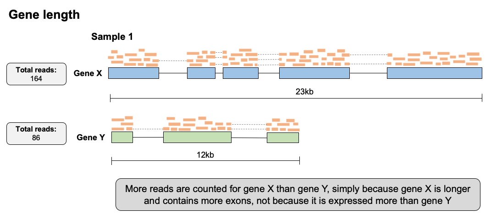

# Normalization of raw counts

Before comparing expression levels of specific genes between samples,
and performing any differential expression analyses, it is important
that we normalize the data to account for variation in expression that
is not related to true differential expression. There are two major
sources variation that we need to adjust for in the normalization
process for RNA-seq data when we wish to compare expression levels
**between** samples:

#### Library size/sequencing depth

Although we generally try to pool samples together (each sample is
tagged with a barcode and samples are combined) at similar
concentrations in a sequencing run, some samples will end up being
sequenced more than others, leading to slight differences in how many
reads are produced for that sample, and therefore sequencing depth and
size. Furthermore, if samples are sequenced on separate runs, their
sequencing depths may be very different. If we don’t account for this
variation in sequencing depth, we might conclude some genes are
expressed at greater levels in a sample that has simply been sequenced
to a higher depth.


#### Library composition

The presence of truly differentially expressed genes (in particular,
DEGs with very large fold changes) between samples will cause the number
of reads for other genes in those samples to be skewed. For example, in
the below example, gene C is differentially expressed between the two
samples, with much higher expression in sample 1. This high number of
reads causes fewer reads to be detected for other genes in this sample,
making it appear that these other genes are expressed at lower levels
than in sample 2, however this is simply an artifact of library
composition differences between the samples.


To correct for **library size** AND **library composition**, DESeq2 uses
a algorithm referred to as the **median-of-ratios** method. Although we
won’t go over how the algorithm works in detail, a brief summary of the
steps is:

1.  Take the log of all values in raw count matrix  
2.  Average each row (genes)
3.  Filter out genes with Infinity values
4.  Subtract average log count value from log of count for each cell
    (due to the laws of working with logarithms, this is essentially
    calculating the ratio of the counts for gene X in 1 sample to the
    average counts for gene X across all samples)
5.  Calculate the median of the ratios in each sample (column)
6.  Take exponents of medians to get the **size factors** for each
    sample/library.
7.  Divide the count for each gene in each sample by the size factor
    calculated for that sample.

This procedure will generate a matrix of read counts that are corrected
for both **library size** and **library composition**, and are stored in
our (`DESeqDataset`) object. DESeq2 uses the function
(`estimateSizeFactors()`) to perform this algorithm and calculate size
factors for each sample. Lets do this for our (`DESeqDataset`).

```r
    dds <- estimateSizeFactors(dds)
```

Note: [This video](https://www.youtube.com/watch?v=UFB993xufUU) from
StatQuest provides an excellent summary of the steps performed by
(`estimateSizeFactors()`) in order to calculate these size factors.

Once we have calculated the size factors, it can be helpful to look at
their distribution to get a feel for how they vary and how much
normalization between the samples is required.

```r
    sizeFactors(dds)

    hist(sizeFactors(dds),
         breaks=6, col = "cornflowerblue",
         xlab="Size factors", ylab="No. of samples",
         main= "Size factor distribution over samples")
```

After we have calculated the size factors, we can use the `counts()`
function, with `normalized` set to `TRUE`), to return the matrix of
counts where each column (each library/sample) have been divided by the
size factors calculated by the `estimateSizeFactors()` function.

```r
    counts_norm <- counts(dds, normalized=TRUE)
    head(counts_norm)
```

Comparing the normalized to the raw counts, we can clearly see that they
are different.

```r
    head(counts(dds, normalized=FALSE))
```
We can use this table of normalized read counts to compare values for
individual genes across samples. We might want to use this to (sanity)
check the expression of a few genes of interest, before we actually do
any statistical modelling. The abstract of the paper describes *DUSP1*,
a phosphatase with dual specificity for tyrosine and threonine, as a
well-known glucocorticoid-responsive gene.

```r
    # lets make a function to generate a quick plot of the normalized counts
    gene_plot <- function(ENSG, gene_symbol){
      # save the normalized counts in a dataframe
      cnts <- counts(dds, normalized=TRUE)
      colnames(cnts) <- colData(dds)$SRR
      # extract the counts for specified ENSG ID and add sample group data
      df1 <- data.frame(log2(cnts[ENSG,]), colData(dds)$tx.group)
      colnames(df1) <- c(paste0("log2_gene"), "sample_group")
      # use ggplot2 to make a plot of counts vs sample group
      p1<- ggplot(df1, aes(sample_group, log2_gene)) +
        geom_jitter(aes(color = sample_group)) +
        ggtitle(paste0(gene_symbol), " - Log2 Normalized counts")
      # print the plot
      print(p1)
    }
    # now apply the function to print a plot for a specified gene
    gene_plot(ENSG = "ENSG00000120129", gene_symbol = "DUSP1")
```

DUSP1 expression is consistently higher in the DEX samples than the
untreated, suggesting this gene is differentially expressed after DEX
treatment, validating prior knowledge and giving us confidence that our
experiment worked, sample labels are all correct, and we are well
positioned to make new discoveries with these data.

**Important note:** the normalized count matrix is normalized for
**library size and composition**, which means we can compare expression
levels of individual genes across samples. The read counts are NOT
normalized for gene length, so we cannot use this matrix to compare
expression levels between genes within the same sample. This is
important because some genes may simply pick up more reads than others
because they are larger, making them appear more highly expressed than a
smaller gene, which may not be the case.

For such comparisons between genes, we need to use measures such as:  
- *Transcripts per million (TPM)*  
- *Fragments per kilobase million (FPKM)*  
- *Reads per kilobase million (RPKM)*

[This
video](https://www.rna-seqblog.com/rpkm-fpkm-and-tpm-clearly-explained/)
provides an excellent explanation of *RPKM*, *FPKM*, & *TPM*, and
explains why it is better to use TPM if you need to correct for
**library size** AND **gene length**.



