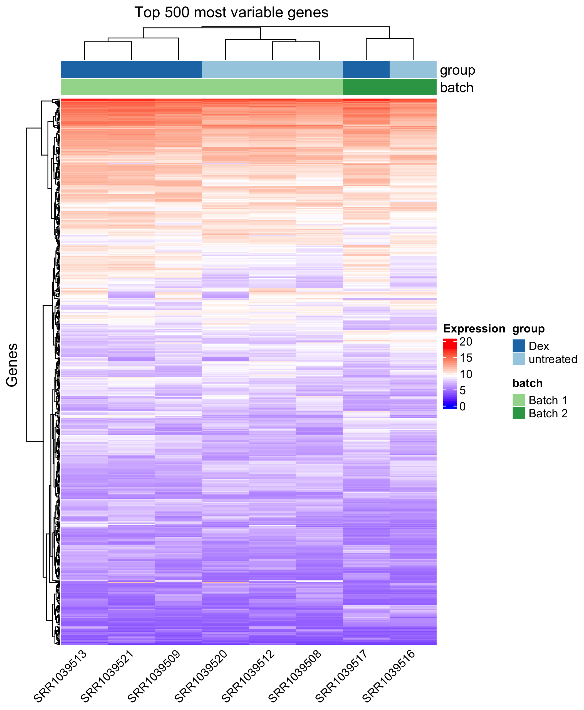

# 01 - Exploratory data analysis

### Learning objectives:
- Understand the principal of dimension reduction for exploratory data analysis
- Develop a working understanding of common dimension reduction approaches such as principal components analysis (PCA) and unsupervised hierarchical clustering
- Learn how to perform dimension reduction in R on RNA-seq data

### Set-up

Load the DESeq2 dataset:
```r
# set working directory (YOU MAY NEED TO CHANGE THIS PATH)
setwd('~/Documents/GitHub/RNA-seq-Differential-Expression-workshop-June-2021/')

# read in the RDS object
dds <- readRDS("DESeq2.rdata")
```

Load required R-packages:
```r
library(ggplot2)
library(DESeq2)
library(pheatmap)
library(ComplexHeatmap)
library(RColorBrewer)
library(circlize)
```

### Introduction

Before running a differential expression analysis, it is good practice to explore the relationships between samples based on their gene global gene expression profiles. This analysis allows perform several quality control checks such as confirming that replicates cluster together, or the dataset is free from batch effects. Furthermore, these analysis allow us to build expectations for our DE analysis.


To perform these analysis, we generally make use of **unsupervised statistical analysis methods**. These methods make no prior assumptions about relationships between samples, and aim to reveal clusters and groups that form naturally in our data.

Such methods are often referred to as **dimension reduction methods** since they generate a simplified representation of the original dataset. We will discuss two of these methods that can be used for RNA-seq data:
- Principal components analysis (PCA)
- Unsupervised hierarchical clustering

> **NOTE:** We will not cover much of the fundamental math, probability and statistics that are required to completely understand the statistical analysis methods discussed. Such training is best sought out through formal instruction, and is usually not included in applied bioinformatics courses. While a complete understanding may not be necessary in all situations, is important to recognize when more specialist expertise is needed to assist with your analysis.

------

### Part 1: Principal components analysis (PCA)

PCA is a very popular approach for dimensionality reduction. At its simplest level, PCA accepts a matrix of numerical values (e.g. gene expression matrix, ChIP-seq counts, etc.), and returns a set of numerical vectors (principal components) that represent the axes of greatest variation in the dataset.

The principal components (PCs) explain distinct sources of variation in the data, and represent the lower-dimensional space that the original dataset has been projected into. Importantly, each PC explains more variation in the dataset than the last (e.g. PC1 explains more variation than PC2).

By using the projection values of each sample along the PCs, we can visualize this lower-dimensional space to learn defining properties of the dataset. e.g. do samples form clusters based on experimental groups?

<p align="center">

</p>

StatQuest has an excellent [video](https://www.youtube.com/watch?v=_UVHneBUBW0) that explains the fundamental concepts of PCA, and provides more details how to the PCs themselves are calculated.

#### Performing PCA on RNA-seq data

To perform mathematical procedures such as PCA, it is best to transform the raw counts. DESeq2 provides its own transformation procedure, called the **regularized logarithm (rlog)** implemented with the `rlog()` function. The rlog is similar in principle to a standard log transformation of the data, but is able to more appropriately transform the counts for genes with low expression values.

It is important to note that `rlog()` transformed values incorporates the size factors calculated for DESeq2 normalization of sequencing depth, therefore rlog values are comparable between samples.

> DESeq2 is also capable of implementing the popular **variance stabilizing transformation (VST)** for count data, which is generally recommended for larger datasets due to increased speed.

To begin, we will remove genes with less than 10 reads across all samples, as there isn’t enough data for these genes to provide meaningful information in these analyses.

```r
# drop genes with low counts
keep <- rowSums(counts(dds)) >= 10
dds <- dds[keep,]

# check the new dimensions
dim(dds)
```

Now use the `rlog()` function to implement the regularized logarithm procedure on our data.
```r
rld <- rlog(dds, blind = FALSE)

# check first few rows
head(assay(rld))
```

We can illustrate the benefit of using the rlog over standard log
transformation (+ a pseudo-count for genes with 0 counts where the log
of 0 is infinity) by comparing the transformed values for two samples
against each other.

```r
# set plotting window to 1 row vs 2 columns
par(mfrow=c(1,2))

# plot standard log counts
cts <- counts(dds, normalized=FALSE)
plot(log2(cts[,1]+1), log2(cts[,2]+1), col = "cornflowerblue", xlab = "Sample 1", ylab = "Sample 2", main = "Log2 + 1")

# plot rlog counts
plot(assay(rld)[,1], assay(rld)[,2], col = "indianred", xlab = "Sample 1", ylab = "Sample 2", main = "rlog")
```
<p align="center">

</p>

To perform PCA, we need to select a set of features (genes) that vary across the samples, and therefore provide information about the differences between samples. Genes that do not vary between samples are not informative for these analysis.

To identify the most variable genes in the dataset, we can calculate the variance (i.e. a measure of spread/standard deviation squared) of the transformed counts for each gene across all samples in the dataset.

```r
# calculate gene expression level variance between samples
var <- rev(rowVars(assay(rld))[order(rowVars(assay(rld)))])

# reset plotting window to 1 row vs 1 columns
par(mfrow=c(1,1))

# plot variance for genes accross samples
plot(var,
     las = 1,
     main="Sample gene expression variance",
     xlab = "Gene", ylab = "Variance")

# add vertical lines at specific gene number indexes
abline(v=1000, col="red")
abline(v=500, col="green")
abline(v=250, col="blue")
```

<p align="center">

</p>

At around 500 the variance starts to increase more dramatically, so it would be reasonable to select these as the *'variable features'* for the PCA.

```r
# modify variable feature number to be used in PCA and hierarchical clustering based on no. of most variable features
var_feature_n <- 500

# calculate the row variance
rv <- rowVars(assay(rld))

# order variance by size and select top 500 with most variance
select <- order(rv, decreasing = TRUE)[1:500]

# subset rlog values for genes with top variance ranks
rld_sub <- assay(rld)[select, ]

# transpose the matrix (rows to columns and columns to rows)
rld_sub <- t(rld_sub)

# run principal components analysis
pca <- prcomp(rld_sub)

# extract the variance explained by each PC
percentVar <- pca$sdev^2/sum(pca$sdev^2)

# subset for first 5 elemets
percentVar <- percentVar[1:5]

# give the string names
names(percentVar) <- c("PC1", "PC2", "PC3", "PC4", "PC5")

# plot variance for top 10 PCs
barplot(percentVar, col = "indianred", las = 1, ylab = "% Variance", cex.lab = 1.2)
```

<p align="center">

</p>

We can see that the majority of variance in this dataset is explained by the first few PCs, therefore a plot comparing PC1 vs PC2 will be sufficient to explore the differences in overall gene expression between these samples.

```r
# construct data frame w/ PC loadings and add sample labels
pca_df <- as.data.frame(pca$x)

# add a column containing tx group
pca_df$tx.group <- dds@colData$tx.group

# add column containing sample IDs
pca_df$sample_ids <- colnames(dds)

# add colors for plotting to df
pca_df$col <- NA
for(i in 1:length(levels(pca_df$tx.group))){
  ind1 <- which(pca_df$tx.group == levels(pca_df$tx.group)[i])
  pca_df$col[ind1] <- i
}

# plot PC1 vs PC2
plot(pca_df[, 1], pca_df[, 2],
     xlab = paste0("PC1 (", (round(percentVar[1], digits=3)*100), "% variance)"),
     ylab = paste0("PC2 (", (round(percentVar[2], digits=3)*100), "% variance)"),
     main=paste0("PC1 vs PC2 for ", var_feature_n, " most variable genes"),
     pch=16, cex=1.35, cex.lab=1.3, cex.axis = 1.15, las=1,
     panel.first = grid(),
     col=pca_df$col)

# add sample names to data points
text((pca_df[, 2])~(pca_df[, 1]), labels = pca_df$tx.group, cex=0.6, font=2, pos=4)
```

<p align="center">

</p>

#### Interpretation

- Most of the samples appear to cluster by treatment group. For example, untreated samples generally have much lower PC1 values than all the Dex samples, suggesting that some of the largest variability in gene expression differences between samples in this dataset explains differences between untreated and Dex treated samples. Therefore we expect the most substantial differential expression to be found for the untreated vs Dex analysis.

- The Alb treated samples, and the co-treated samples (Alb\Dex) do not seem to consistently cluster along PC1 and PC2. One explanation for this could be that treatment with Alb or co-treatment with Alb & Dex have inconsistent effects on gene expression. This is often the case with *in vivo* model systems, which often demonstrate more inherent variability, and may require more replicates to confidently determine if a trend exists of not.

#### Batch effect detection with PCA

Another explanation could be there is variable, unrelated to the experimental groups, that explains a lot of the sample-to-sample variability, such as a batch effect. **Batch effects** are non biological variables that alter the overall representation of data from an experiment, and if left unidentified, can lead to many incorrect conclusions about the results.

One common reason for batch effects is that samples that were processed in separate batches, and variability between the sample processing between the batches resulted in detectable changes in gene expression.

Multiple batches were not reported in the manuscript for this dataset, however, to demonstrate what you would expect to see if a true batch effect existed, we will artificially introduce one by labelling specific samples as `Batch 1` or `Batch 2`. We can re-generate the PCA plot and include symbols to denote which batch a sample was processed in.

```r
# add variable to PCA dataframe for batch
pca_df$batch <- NA

# (artificially) select samples with a PC2 value below 10 to batch 1
pca_df$batch[pca_df$PC2 < 10] <- "Batch 1"
# (artificially) select samples with a PC2 value above 10 to batch 2
pca_df$batch[pca_df$PC2 > 10] <- "Batch 2"

# convert string to factor
pca_df$batch <- factor(pca_df$batch, levels = c("Batch 1", "Batch 2"))

# plot PC1 vs PC2 but only for batch 1 samples
plot(pca_df[pca_df$batch=="Batch 1", 1], pca_df[pca_df$batch=="Batch 1", 2],
     xlab = paste0("PC1 (", (round(percentVar[1], digits=3)*100), "% variance)"),
     ylab = paste0("PC2 (", (round(percentVar[2], digits=3)*100), "% variance)"),
     main=paste0("PC1 vs PC2 for ", var_feature_n, " most variable genes"),
     pch=16, cex=1.35, cex.lab=1.3, cex.axis = 1.15, las=1,
     panel.first = grid(),
     col=pca_df$col,
     ylim=c(-14,20))

# add points for batch 2 samples but use different shape to denote batch
points(pca_df[pca_df$batch=="Batch 2", 1], pca_df[pca_df$batch=="Batch 2", 2],
       col=pca_df$col,
       pch=2, cex=1.35)

# add legend
legend(9.5, 10.5, levels(pca_df$batch), pch = c(16, 2))
legend(1.5, 11.5, levels(pca_df$tx.group), pch = 16, col = pca_df$col)

# add sample names as text to points
text((pca_df[, 2])~(pca_df[, 1]), labels = pca_df$tx.group, cex=0.6, font=2, pos=4)
```

<p align="center">

</p>

#### Interpretation

The four samples labelled as batch 2 clearly cluster separately on PC2 from the rest of the samples, suggesting that batch is deterministic of gene expression profiles in these data. Consequently, these samples in Batch 2 will increase the within-group variance between samples, leading to a loss of statistical power in the DE analysis, and ultimately reducing the number of DE genes we could detect.

#### Dealing with a batch effect

A comprehensive introduction of how to correct for a batch effect is beyond the scope of this workshop, however, a couple of basic options you could explore if you detect a batch effect are included below.

- statistically remove the batch effect from your data using an algorithm designed specifically for this task. e.g. [ComBat](https://academic.oup.com/nargab/article/2/3/lqaa078/5909519)
- adjust for batch as a variable in your statistical model when running differential expression
- remove the samples driving the batch effect, provided you have a good reason to suspect specific samples

Deciding on which approach to take is a complicated issue, and is largely dependent on the extent of the batch effect. If the batch effect is very large, it may be too difficult to effectively remove it statistically, or regress out variation attributable to it in the DE analysis.

Ultimately, the easiest way to handle a batch effect if to prevent it from ever occurring. Whwere possible, practice your protocol and confirm you can get consistent replicates before committing to the full experiment.

**Take home message on batch effects:** If your experiment includes
multiple batches, check them in your unsupervised
analyses to check for a batch effect.


----------


### Part 2: Unsupervised hierarchical clustering

Hierarchical clustering is complimentary to approaches like PCA, and is used to assess relationships between samples and features (e.g. genes) in a dataset. Visualizing these relationships provides insight into which samples are most similar/dissimilar, as well as identify genes that changes in similar ways across a dataset.

Both supervised and unsupervised clustering methods exist, however unsupervised methods are generally used when we have no prior expectation for groups (clusters) thats should exist in the data. To generate clusters, a **distance metric** is calculated, where smaller values represent more similar samples, which are grouped together into clusters. A **dendrogram** is used to represent the relationships between samples, as determined during the clustering process. The results are commonly visualized using a heatmap.

<p align="center">

</p>

Expression levels of each gene determine the colors shown in each cell of the heatmap, and allow us to identify genes expressed at different levels across samples. If both columns and rows are clustered, samples which share similar expression profiles will be placed closer to each other on the dendrogram, while genes that demonstrate similar patterns of variation across sample will be placed closer together, allowing us to identify **modules** of co-varying genes.

Although we will not go into detail on how the clustering algorithm works, **StatQuest** has an [excellent video](https://www.youtube.com/watch?v=7xHsRkOdVwo&ab_channel=StatQuestwithJoshStarmer) that explains the process in more detail, as well as [another video](https://www.youtube.com/watch?v=oMtDyOn2TCc&ab_channel=StatQuestwithJoshStarmer) that summarizes the process of drawing and interpreting heatmaps.

> ##### Distance metrics
Several distance metrics exist (e.g. Euclidean distance, Manhattan distance) and are calculated differently. Although the results will often be the same across several distance metrics, which one is most appropriate depends on your dataset.

#### Cluster the dataset using unsupervised clustering  

Similarly to the PCA, we perform the clustering using the **rlog
transformed data** and the **500 most variable features**, as features that do not vary across samples are not informative for dimension reduction approaches.

```r
# select top X no. of variable genes
topVarGenes <- head(order(rowVars(assay(rld)), decreasing=TRUE), var_feature_n)

# set up gene expression matrix
mat1 <- assay(rld)[topVarGenes,]

# set up colors for heatmap
col = colorRamp2(c(0, 9, 18), c("blue", "white", "red"))
cols1 <- brewer.pal(11, "Paired")

# set up annotation bar for samples
ha1 = HeatmapAnnotation(Group = colData(dds)$tx.group,
                        col = list(Group = c("untreated" = cols1[1],
                                             "Dex" = cols1[2],
                                             "Alb" = cols1[5],
                                             "Alb_Dex" = cols1[6])),
                                             show_legend = TRUE)

# se up column annotation labels (samples)
ha = columnAnnotation(x = anno_text(colData(dds)$SRR,
                                    which="column", rot = 45,
                                    gp = gpar(fontsize = 10)))
# generate heatmap object
ht1 = Heatmap(mat1,
              name = "Expression",
              col = col,
              top_annotation = c(ha1),
              bottom_annotation = c(ha),
              show_row_names = FALSE,
              show_column_names = FALSE)

# plot the heatmap
draw(ht1, row_title = "Genes", column_title = "Top 500 most variable genes")
```

<p align="center">

</p>

As we saw in the PCA, the Alb and co-treated samples do not form any
clear clusters. We may want to remove them and perform the clustering
again so that we can compare the untreated and Dex samples more easily.

```r
# select sample groups to keep
ind_to_keep <- c(which(colData(rld)$group=="untreated"), which(colData(rld)$group=="Dex"))

# select top variable features
topVarGenes <- head(order(rowVars(assay(rld)[,ind_to_keep]), decreasing=TRUE), var_feature_n)

# set up gene expression matrix
mat1 <- assay(rld)[topVarGenes, ind_to_keep]

# set up colors for heatmap
col = colorRamp2(c(0, 9, 18), c("blue", "white", "red"))
cols1 <- brewer.pal(11, "Paired")

# subset coldata for samples in untx and ex groups
colData_sub <- colData(dds)[ind_to_keep, ]

# set up annotation bar for samples
ha1 = HeatmapAnnotation(Group = colData_sub$tx.group,
                        col = list(Group = c("untreated" = cols1[1],
                                             "Dex" = cols1[2])),
                                             show_legend = TRUE)

# se up column annotation labels (samples)
ha = columnAnnotation(x = anno_text(colData_sub$SRR,
                                    which="column", rot = 45,
                                    gp = gpar(fontsize = 10)))
# generate heatmap object
ht1 = Heatmap(mat1, name = "Expression", col = col,
              top_annotation = c(ha1),
              bottom_annotation = c(ha),
              show_row_names = FALSE,
              show_column_names = FALSE)

# plot the heatmap
draw(ht1, row_title = "Genes", column_title = "Top 500 most variable genes")
```

<p align="center">

</p>


There does appear to be reasonable clustering between
untreated and Dex samples, suggesting there are unique gene expression programs defining the Dex samples from the untreated. However, one of these samples in the Dex group seems to be clustered further away from the other Dex samples. This could be the Dex treated sample that clustered away from the other Dex treated samples on the PCA. We can add an annotation bar for the fake batch effect we created earlier to this plot to confirm this.

```r
# which samples had values > 10 for PC2
pca_df$sample_ids[pca_df$PC2 > 10 & pca_df$tx.group=="untreated"]
# or <10 for PC2
pca_df$sample_ids[pca_df$PC2 > 10 & pca_df$tx.group=="Dex"]

# set the batch variable for these samples as batch 2
colData_sub$batch <- "Batch 1"
colData_sub$batch[colData_sub$SRR=="SRR1039516"] <- "Batch 2"
colData_sub$batch[colData_sub$SRR=="SRR1039517"] <- "Batch 2"
							     
# add a second color palate to annotate batch
cols2 <- brewer.pal(3, "Greens")

# set up annotation bar for samples
ha1 = HeatmapAnnotation(group = c(as.character(colData_sub$tx.group)),
                        batch = c(as.character(colData_sub$batch)),
                        col = list(group = c("untreated" = cols1[1], "Dex" = cols1[2]),
                        batch = c("Batch 1" = cols2[2], "Batch 2" = cols2[3])),
                        show_legend = TRUE)

# generate heatmap object
ht2 = Heatmap(mat1, name = "Expression", col = col,
              top_annotation = c(ha1),
              bottom_annotation = c(ha),
              show_row_names = FALSE,
              show_column_names = FALSE)

# plot the heatmap
draw(ht2, row_title = "Genes", column_title = "Top 500 most variable genes")
```

<p align="center">

</p>

Based on our newly labeled plot it does seem that these 2 samples are
outliers, supporting the presence of a potentially non-biological factor affecting gene expression in these data (such as a batch effect).

