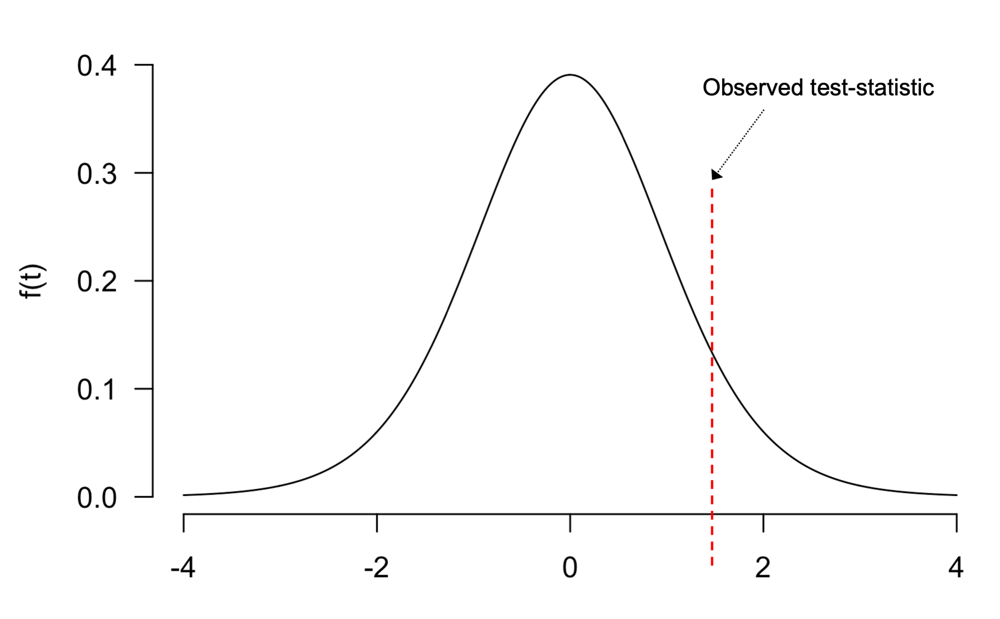
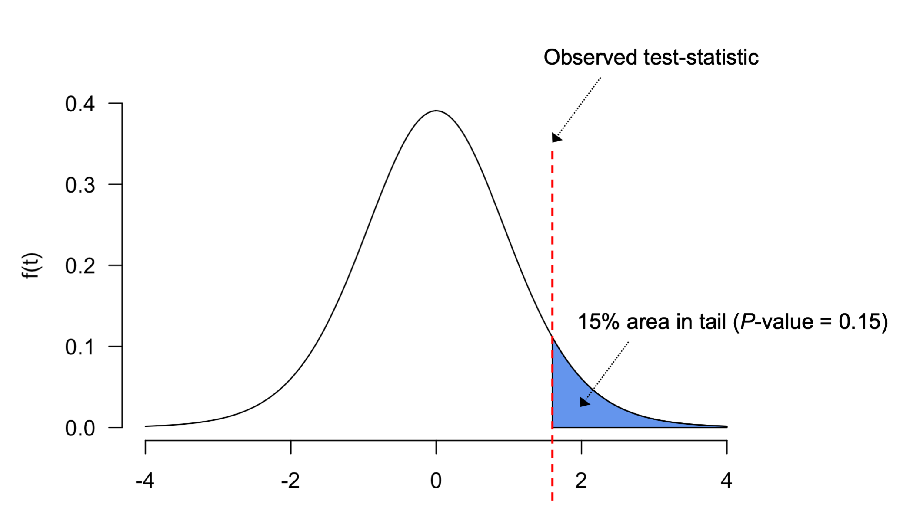
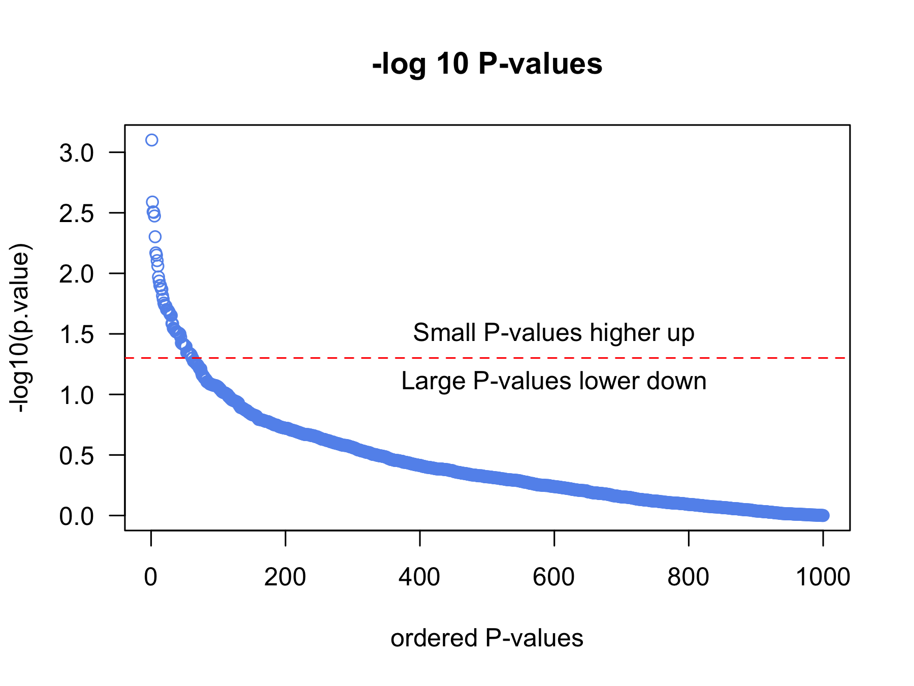

# 02 - Fundamental statistics for Differential Expression analysis

### Learning objectives:
- Understand the basic principles of statistical hypothesis testing
- Understand the multiple testing problem and why it must be corrected for in genomic data analysis
- Learn how to implement basic multiple testing procedures in R

### Introduction

RNA-seq analysis, like many things in bioinformatics, draws on knowledge from multiple disciplines, all of which are required to effectively make inferences from a dataset. In particular, downstream analyses, such as differential gene expression, requires working knowledge of basic statistics.

<p align="center">
  
</p>

There are several key aspects of basic statistics that we must understand to effectively perform a differential expression analysis:
- Hypothesis testing
- Multiple testing correction
- Linear modeling

The following lesson should not be considered a comprehensive introduction to these topics, but rather a platform from which to further your understanding in the future.

-----

### Part 1: Hypothesis testing

In bioinformatic data analysis, we often conduct hypothesis testing to assess how meaningful our results are. For example, in RNA-seq analysis, we would like to know which genes showed meaningfully different gene expression between the experimental groups. **Hypothesis testing** describes the statistical framework that we use to assess how meaningful our results are.

**General procedure for hypothesis testing:**
1. Decide on the null hypothesis (*H<sub>0*)
2. Use the sample data to calculate a test statistic
3. Use the test-statistic to calculate a P-value
4. Reject the null hypothesis if P-value is below your *a priori* threshold

To help understand this procedure for, some useful definitions:
- **Null hypothesis (*H<sub>0*)** - the hypothesis that there is **no** meaningful difference* between our samples
- **alternative hypothesis (*H<sub>A*)** there is a meaningful difference between our samples
- **test-statistic** - quantity determined from your dataset comparing your results to those you would expect under the null hypothesis (that is, no true difference exists)
- **P-value** - probability of observing data equal to or more extreme than that observed due to chance


When performing hypothesis testing, we assume our data come from a distribution with a known area. By calculating quantities from our data (e.g. mean, standard deviation, sample size) we can use this distribution to calculate the **test-statistic**. As defined above, this statistic compares our data to a known distribution and tells us how extreme our result is to the null distribution.

Several types of test-statistics exist, and which one we use depends on the type of data we have and the assumptions we make about it. In the example below, we will use the **t-statistic**, which is based on the **t-distribution** (shown below, similar to a normal dist.).

<p align="center">
  
</p>

> ***Degrees of freedom (df)*** represent the number of independent values that can vary in a dataset, and is calculated as the sample size (*N*) - 1. The number of degrees of freedom affects the shape of the t-distribution, as shown in the figure above.

You can learn more about degrees of freedom [here](https://www.statisticshowto.com/probability-and-statistics/hypothesis-testing/degrees-of-freedom/).

Assuming a t-distribution, the **t-statistic** can be calculated from your dataset using the equation:

*t-statistic* = (*x<sub>i</sub>* - &mu;) / (*s* x sqrt(*n*))

Where:
- *x<sub>i</sub>* = sample mean (*i* denotes this is calculated for each sample)
- *&mu;* = population mean
- *s* = standard deviation
- *n* = sample size


Placing our test-statistic on the t-distribution (red dotted line in figure below) allows us to see how extreme our result is compared to the null distribution. Larger test-statistics will be further toward the tails of distribution.

<p align="center">
  
</p>


To help us decide if the null hypothesis should be rejected or accepted based on this test-statistic, we must calculate a **P-value**, defined as *the probability of observing data equal to or more extreme than that observed due to chance*.

It is sometimes helpful to consider P-values as a %, for example, if you if you have a *P*-value of **0.01**, there is a **1%** chance that your results occurred simply by chance (i.e. randomly). Alternatively, a *P*-value of **0.9** means there is a **90%** chance that this result would be observed by chance.

Visually, the *P*-value is defined as the area under the curve to the right or left of the test-statistic (provided you run a two-tailed test).

<p align="center">
  
</p>


The tails of the t-distribution contain the least area, therefore obtaining a large t-statistic simply due to chance is less likely, suggesting a result is extreme enough to reject the null hypothesis (that no true difference exists between our experimental groups).

If we assume a *P*-value threshold of 0.05 (& a two-tailed test), our test-statistic must be large enough that less than 2.5% of the density under the curve is to the right or left of our this value.

<p align="center">
  
</p>

In this figure, the test-statistic is large enough that the area under the curve represents a P-value < 0.05, therefore we can reject the null hypothesis and **accept the alternative hypothesis, that a there is significant difference between our comparison groups.**

If the test-statistic was not large enough, and the P-value was >0.05, we would need to accept the null hypothesis that no significant difference exists.


> **P-value thresholds:** Although 5% is a commonly used P-value threshold, you can be more or less stringent depending on the nature of your experiment: if you want to be very conservative and restrict your results to few results that are likely to be true positives, you may wish to restrict the results to a more stringent threshold. If your experiment is very preliminary and you care less about capturing some false positives than missing true positives, you may wish to relax your threshold.  

------

### Part 2: The multiple testing problem

In RNA-seq, we measure thousands of genes simultaneously and run a statistical test for each of them when trying to identify those that are differentially expressed across conditions.

As we defined above, P-values are *the probability of observing data equal to or more extreme than that observed due to chance*. Therefore, by definition, if we use 0.05 as a P-value threshold, and test 20,000 genes for differential expression, by definition 5% of those genes will have a log2 fold-change that large **simply due to chance**. 5% of 20,000 is 1000 genes, which is obviously an unacceptable amount of false-positives...

We can classify the different types of errors and decisions we make during hypothesis testing according to how they fit with the actual truth observed in nature, as shown in the below table.

<p align="center">
  
</p>

- False positives are generally referred to as **Type I error**.
- False-negatives are referred to as **Type II error**.

As we discussed above, at a 5% significance level, there is a 5% chance of rejecting the null by mistake (committing a type I error). As we perform more and more tests, the number of times we mistakenly reject the null will increase, causing us to make more and more false-positive claims.

We can demonstrate the multiple testing problem by simulating some very simple data that come from exactly the same distribution, and therefore should have no significant differences between them, so we should never reject the null in theory.

```r
# generate an empty vector to store P-values in
p.value <- c()

# generate 2 random variables (r.v.s) 1000 times and run a t.test on each pair of r.v.s
# the r.v.s will have the same mean and distribution
for(i in 1:1000){
  # simulate random variables
  x <- rnorm(n = 20, mean = 0, sd = 1)
  y <- rnorm(n = 20, mean = 0, sd = 1)
  # run t.test and extract p-value
  p.value[i] <- t.test(x, y)$p.value
}

# count number of P-values less than our alpha
table(p.value < 0.05)

# order vector of P-values
p.value <- p.value[order(p.value)]

# visualize P-value magnitude
plot(-log10(p.value), las = 1,
     col = "cornflowerblue",
     main = "-log 10 P-values",
     xlab = "ordered P-values")
#### Note: taking -log10 of small number gives big number!

# add a horizontal line
abline(h=-log10(0.05), col = "red", lty = 2)

# add some useful labels
text(600, 1.5, "Small P-values higher up")
text(600, 1.1, "Large P-values lower down")
```

<p align="center">
  
</p>

Roughly 5% of the time, we commit a type I error. Left unchecked in genomics and bioinformatics studies, this error would cause a vast number of findings to be attributable to noise.

---

### Part 3: Methods for multiple testing correction

We address the multiple testing problem through *multiple testing correction*, which describes a number of statistical approaches for controlling the type I error rate, preventing us from making a large number of false positive claims.

#### Bonferroni correction

The simplest multiple testing correction method is the *Bonferonni* correction, which seeks to control the family-wise error rate (FWER): *the probability of making at least 1 false positive claim.*

To control for the FWER, the &alpha; threshold you have chosen for your experiment is divided by the number of tests performed, and any P-value must achieve significance below this threshold to be described as significant. In our example above where we ran 1000 tests at a 5% significance level, the correct alpha would be 0.05/1000 = 5e-5, so any P-value needs to be < 5e-5 to be deemed significant.

We can demonstrate this by plotting the Bonferonni threshold on the plot for our previous example:
```r
# visualize P-value magnitude
plot(-log10(p.value), las = 1,
     col = "cornflowerblue",
     main = "-log 10 P-values",
     xlab = "ordered P-values", ylim = c(0,5))

# add a horizontal line
abline(h=-log10(0.05), col = "red", lty = 2)
text(600, 4.5, "Bonferroni")

# add a horizontal line
abline(h=-log10(0.05/1000), col = "red", lty = 2)
text(600, 1.5, "Original threshold")
```

<p align="center">
  
</p>

We can also calculate a new set of P-values that have been adjusted by the Bonferonni method (P-values are multiplied by the number of comparisons), which can be evaluated at the 0.05 significance value.
```r
# bonferroni correction
p.adj.bonf <- p.adjust(p.value, method = "bonferroni")
p.adj.bonf

# check if any are signifciant
table(p.adj.bonf < 0.05)
```

By definition, Bonferroni correction guards against making even 1 false-positive, which is often too conservative in genomics experiments where we are using trying to generate new hypotheses in an exploratory fashion. Consequently, we often use other multiple testing correction methods in genomics, such as the false discovery rate (FDR).


#### False discovery rate

The *false discovery rate (FDR)* is a less conservative method of multiple testing correction, and can therefore be more powerful in genomics experiments, as it will lead to fewer false-negatives, at the expense of increased false positives (compared to Bonferroni).

FDR is defined as the proportion of false discoveries among all significant results. Controlling the false discovery rate at 5% means we accept 1 in 20 of the results we call significant, are actually false positives.

<p align="center">
  
</p>

To control for the FDR, we can use a list of P-values to calculate a *q-value* for each of these P-values in our list. A *q-value* for a specific test is defined as expected proportion of false-positives among all features called as or more extreme than the one in question.

For example, if an individual gene for an RNA-seq differential expression analysis has a q-value of 0.01, this means 1% of genes with a lower significance value than this gene will be false-positives.  

You can calculate q-values using the Bioconductor package `qvalue`.
```r
# load the qvalue package
#BiocManager::install("qvalue")
library(qvalue)
qvalue(p.value)$qvalues
p.adj.fdr <- qvalue(p.value)$qvalues

# check how many are sig.
table(p.adj.fdr < 0.05)
```

No results were identified as significant after correcting for multiple testing, which is what we expected should be true since we drew our random samples from the exact same distributions.

This example highlights the short coming of hypothesis testing approaches, and demonstrates how important it is to correct for multiple hypothesis testing. **Always perform multiple testing correction**.


A good summary of multiple testing correction in high throughput genomics experiments can be found [here](https://www.nature.com/articles/nbt1209-1135). An excellent video describing the FDR-based methods can be found [here](https://www.youtube.com/watch?v=K8LQSvtjcEo&ab_channel=StatQuestwithJoshStarmer) by StatQuest.

> FDR correction is often favourable in RNA-seq differential expression analysis as we are often interested in being less conservative and generating new hypothesis. DESeq2 performs multiple testing correction by default using FDR correction. We will demonstrate how the corrected P-values can be extracted from the results in a following lesson.
