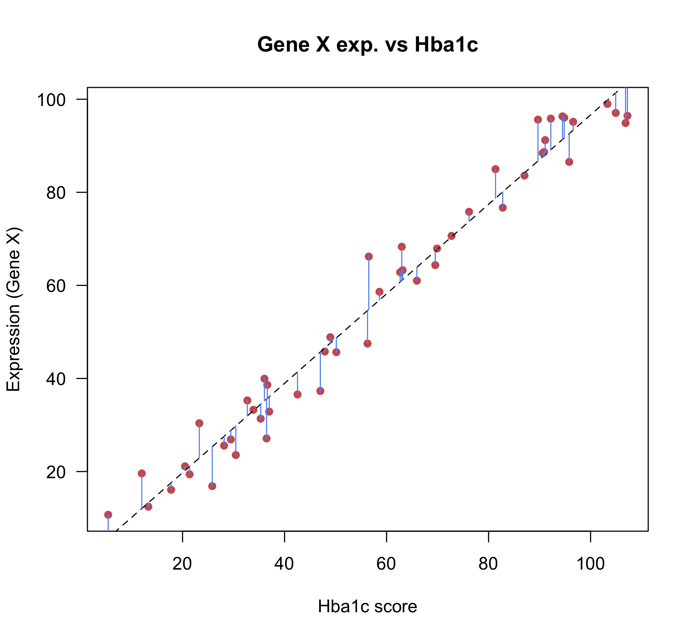
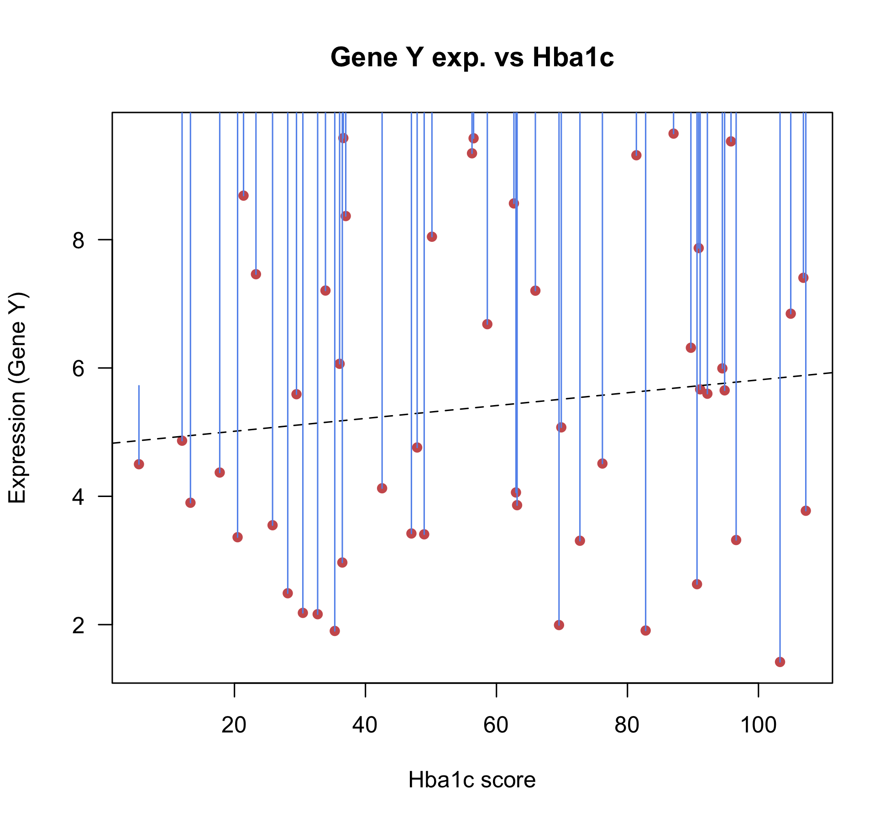

# 03 - Introduction to linear models

### Learning objectives:
- Understand the basic principles of linear models and why they are useful in RNA-seq DE analysis
- Learn how to fit basic linear models in R

### Introduction

Simple linear models, or linear regression, is used pervasively in bioinformatics and genomics for statistical inference. Linear models are relatively simple, flexible, and interpretable, meaning they make excellent tools for statistical inference and they scale well to thousands of observations, which is critical for common genomics datasets.

Beyond differential expression analysis, many types of genomic data analysis rely on linear models:
- ChIP-seq (differential binding)
- ATAC-seq (differential accessibility)
- Microarray analysis (e.g. DNA methylation)
- Variant identification (WES/WGS/RNA-seq)
- Genome-wide association studies (GWAS)

When performing differential expression analysis with popular R-packages such as DESeq2, you usually do not need to explicitly define a linear model yourself using base functions in R. However, it is important that you understand what is going on 'under the hood' in order to always perform your analysis correctly.

In the lesson below, we will introduce the basic concepts of linear models and how they can be fit in R, in order to provide you with a foundation upon which to begin learning the basics of differential expression analysis.

> NOTE: Linear modeling is the topic of entire independent courses and again requires knowledge of appropriate mathematics and probability to understand completely. Thus, this should be considered an introduction rather than a standalone resource.

------

### Part 1 - Basic terminology

In a standard linear model, we assume that some *response* variable (*Y*) can be represented as a linear combination of a set of *predictors* (*X*, independent variables). In building a linear model, we estimate a set of *coefficients* that explain how the *predictors* are related to the *response*. We can use these *coefficients* for statistical inference to better understand which predictors are associated with our response, or for applying the model to new data where we wish to predict the response variable using only a set of predictors.

Before reviewing the statistical notation for a simple linear model, it can be useful to first consider the main components:
`response = predictor(s) + error`

- **The *response*** is the dependent variable we wish to model based on some set of predictors (*Y*)

- **The *predictor(s)*** is the independent variable, or variables, that we wish to model as a linear combination of the response (this is usually what we are interested in for statistical inference and hypothesis testing) (*X*)

- **The *error*** component represents the information not explained by the model, and exists since we know that no set of predictors will perfectly explain the response variable. These are often referred to as the *residuals* of the model.

Using the statistical notation for a simple linear regression model:

Y = &beta;<sub>0</sub> +  &beta;<sub>i</sub> X<sub>i</sub> + &epsilon;

- Y is a continuous response variable that we assume is normally distributed
- &beta;<sub>i</sub> are the coefficients to be estimated (&beta;<sub>i</sub>-value)
- X<sub>i</sub> are the predictors
- &beta;<sub>0</sub> refers to the model intercept
- &epsilon; refers to the error term (residuals) and are assumed to follow a normal distribution

There can be any (reasonable) number of predictors (X) in a model, and predictors can be either *continuous* (e.g. age) or categorical (e.g. treatment group, batch).

Each predictor is associated with a coefficient that describes the relationship of that predictor to the response variable. In the context of linear regression, the coefficient is also referred to as the *slope*.

------

### Part 2 - Linear models in R

In R, the basic syntax for a basic linear model is: `lm(response ~ predictor)`. Lets simulate some data that we can use to illustrate the theory described above and fit out first linear model in R.

```r
# read in the example data
dat <- read.csv("data/lm-example-data.csv", stringsAsFactors=FALSE)

# explore it quickly
head(dat)
str(dat)

# plot
plot(dat$gene_exp ~ dat$hba1c,
	ylab = "Expression (Gene X)",
	xlab = "Hba1c score",
	main = "Gene X exp. vs Hba1c",
	col = "indianred", pch = 16, las = 1)

# fit a linear model with gene expression as the response
lm1 <- lm(dat$gene_exp ~ dat$hba1c)
lm1
```


The coefficient for the independent/predictor variable, Hba1c, describes its relation to the response variable, expression of gene X. Here, the coefficient is telling us that *for every 1 unit increase in gene expression measured, Hba1c levels increase by ~0.96 units*.

This is basic *statistical inference*, as we have used this procedure to model the relationship between two variables, and *infer* something about how those variables are related.

To help us better understand the model, we can plot the regression line on our scatterplot.
```r
# generate plot again
plot(dat$gene_exp ~ dat$hba1c,
	ylab = "Expression (Gene X)",
	xlab = "Hba1c score",
	main = "Gene X exp. vs Hba1c",
	col = "indianred", pch = 16, las = 1)

# add the model on the scatterplot
abline(lm1, lty=2)

# calculate the predicted gene expression values using the model
pre <- predict(lm1)

# plot the difference between the predicted and the true values
segments(dat$hba1c, dat$gene_exp, dat$hba1c, pre,
	col="cornflowerblue")
#### Note: These are the residuals!
```


The regression line (shown in black) illustrates the clear linear relationship between expression of gene X and Hba1c levels.

The residuals (blue lines) describe how far away each observation (the gene expression values) are from the predicted values from the linear model. All observations are close to the regression line, suggesting the model is a good fit for the data.

**However**, by virtue of this being a statistical model, all coefficients are estimated with some level of uncertainty. If the model is a poor fit for the data, there will be a high uncertainty in the coefficient.

One way to evaluate how much meaning we should attribute to the coefficient, is to calculate a *P*-value for it through hypothesis testing, which we will explore below.

> **Note:** Although standard models for modeling gene expression data would include expression values as the response variable, these models usually take on a more complicated form (see note on *Generalized linear models* below), however we have set up a simple model for teaching purposes.

------

### Part 3 - Hypothesis testing with linear models

In order to test how much certainty we have for a particular coefficient from a linear model, we estimate a quantity called **the standard error (SE)**. Without discussing the underlying statistics that define it, the SE is essentially a *measure of certainty around the coefficient*, and is dependent on the variance of the residuals (&epsilon;).

Importantly, the SE can be used to perform **hypothesis testing** to determine if the coefficient is statistically significant. In this case, we can test the null hypothesis that the coefficient is equal to zero, using the following equation to calculate the *t-score*:

*t-score* = (&beta;<sub>i</sub>) - 0 / SE(&beta;<sub>i</sub>)

The *t-score* can then be used to calculate a *P*-value, as described in the hypothesis testing section. In R, the `summary()` function will test all model coefficients against the null hypothesis:
```r
sum_lm1 <- summary(lm1)
sum_lm1

# get the coefficients table
coef(sum_lm1)

# get the coefficients themselves
coef(sum_lm1)[,1]

# get the P-value for the hba1c coefficient
coef(sum_lm1)[2,4]
```

The *P*-value is very small, so we can reject the null, and conclude that Hba1c levels are associated with expression of gene X, and interpret the coefficient as a meaningful quantity.

If the *P*-value does not pass the *a priori* significance threshold for your analysis, the coefficient should be ignored as that predictor is **not associated** with the response variable.

You can always confirm by looking at the slope in a simple linear model. To demonstrate this, explore the example below for Gene Y and its relation to Hba1c levels.
```r
# read in the example data
dat2 <- read.csv("data/lm-example-data-geneY.csv", stringsAsFactors=FALSE)

# plot
plot(dat2$gene_exp ~ dat2$hba1c,
	ylab = "Expression (Gene Y)",
	xlab = "Hba1c score",
	main = "Gene Y exp. vs Hba1c",
	col = "indianred", pch = 16, las = 1)

# fit a linear model with gene expression as the response
lm1 <- lm(dat2$gene_exp ~ dat2$hba1c)
summary(lm1)
pre <- predict(lm1)

# add the model on the scatterplot
abline(lm1, lty=2)

# plot the difference between the predicted and the true values
segments(dat2$hba1c, dat2$gene_exp, dat2$hba1c, pre, col="cornflowerblue")

```




The flatter slope of the regression line and larger values of the residuals, suggests there is no useful relationship between Hba1c levels and expression of gene Y, which is supported by the large *P*-value returned by the model.


------

### Part 4 - Simple Linear modeling with categorical variables

In genomics, we commonly have categorial predictor variables, in contrast to the continuous variable (Hba1c) from our example above. Examples of categorial variables include:
- Wild-type vs knockout
- Vehicle vs treatment
- Control vs diseased

Importantly, linear models are capable of incorporating categorical variables as predictors. Lets consider another example, where we have gene expression levels for gene X measured in 20 healthy tissues, and 20 diseased tissues, and we wish to use a linear model to explore the relationship between gene expression and disease status.

```r
# read in the example data
dat3 <- read.csv("data/lm-example-3.csv", stringsAsFactors=FALSE, row.names = 1)

# quickly explore it
head(dat3)
table(dat3$subject_group)
# Note: Controls are coded as 0, cases are coded as 1

# visualize the data
boxplot(dat3$exp_geneX ~ dat3$subject_group ,
     ylab = "Expression (Gene X)",
     xlab = "Subject group",
     main = "Gene X exp. in subject groups",
     col = c("indianred", "cornflowerblue"), pch = 16, las = 1)


# run the linear model and evaluate
lm_2 <- lm(dat3$exp_geneX ~ dat3$subject_group)
summary(lm_2)
```


Looking at the model output, the *P*-value is very small, therefore we can conclude that there is an association between expression of gene X and disease status in this sample.

Again, the coefficient tells us about the relationship between the predictor and the response. The coefficient for the predictor `subject_group` tells us that for each unit increase in this variable, there is an increase of 11.2 expression units for gene X.

Since a 'unit increase' in `subject_group` simply means controls vs diseased subjects, we can interpret this as the difference in expression between controls and cases. This is analogous to how we would calculate a fold-change value in an RNA-seq analysis.

------

### Part 4 - Multiple regression

We could have simply addressed the above analysis using a more simple statistical test such as a *t-test*. However, we commonly want to include additional variables in our linear models, and approaches such as the t-test cannot handle this scenario.

For example, we might want to control for factors that could confound gene expression differences between the control and diseased groups. For example, we could control for age and sex of the subjects, or perhaps the batch the samples were collected in.

In this scenario, we can use linear models to control for the additional variables by adding them into the statistical model e.g.

*Just an example do not run this code*
```r
lm(dat3$exp_geneX ~ dat3$subject_group + dat3$age + dat3$gender + dat3$batch)
```

This approach is referred to as **multiple regression**. If you will be doing any sort of complex bioinformatics data analysis involving linear models, I strongly encourage you to use this primer as a starting point to learn more about multiple regression and more complex linear modeling scenarios.

---

### Part 5 - Generalized linear models

While standard linear models are very useful, there are situations where their use is not appropriate, for example:

- when values of Y are restricted (e.g. must be positive integers or binary values, such as with count data from NGS experiments)
- when the variance of Y depends on the mean (such as with RNA-seq data, see below..)

As we have discussed, RNA-seq is measured in terms of read counts, whose values are restricted to being positive integers. If we visualize the distribution of RNA-seq data, we will see that the counts follow a distribution different from the normal distribution.

Plot the distribution of normalized read counts from a single sample:
```r
#reload DESeq2 dds object if not saved from previous lesson
#dds <- readRDS("data/DESeq2.rds")

hist(counts(dds, normalized=FALSE)[,5],
     breaks = 500, col="blue",
     xlab="Raw expression counts",
     ylab="Number of genes",
     main = "Count distribution for sample X")
```

<p align="center">

</p>


We can easily see that the counts do not follow a normal distribution: most genes have very low count values, with relatively few demonstrating higher expression levels.

Based on this observation, the counts cannot be modeled appropriately using a standard linear model. In fact, bulk RNA-seq data generally exhibit a distribution referred to as the *negative-binomial*, therefore we must us a model that assumes this distribution when performing differential expression testing. **We will discuss this in more detail on Friday**.

RNA-seq read counts are also referred to as **heteroscedastic**, meaning they have a *non-constant variance* at different values of the mean across samples. We can see this if we plot the variance in read counts across samples against the mean.

```r
# calculate mean and variance for group of replicates
mean_counts <- apply(counts(dds, normalized=FALSE)[,1:3], 1, mean)
variance_counts <- apply(counts(dds, normalized=FALSE)[,1:3], 1, var)

# plot the mean variance trend
plot(log10(mean_counts), log10(variance_counts),
     ylim=c(0,9), xlim=c(0,9),
     ylab = "log10 (mean counts)", xlab = "log10 (variance)",
     main = "Mean-variance trend", las = 1)

# add line for x=y
abline(0,1,lwd=2,col="red")
```

<p align="center">

</p>

Linear models assume that variance around the mean is constant, therefore RNA-seq data clearly violate this assumption, further demonstrating that standard linear models cannot be used for RNA-seq data.

Instead, we need a statistical model that can leverage distributions other than the normal. *Generalized linear models (GLM)* are a family of statistical models that can achieve this, and generalize standard linear regression in two ways:
- use of probability distributions other than the normal distribution
- the use of a *link-function* that links the expression values in the linear model to the experimental groups, in a way that these other distributions can be used.

For analysis of bulk RNA-seq data, we use a GLM of the *negative-binomial family* in order to appropriately model RNA-seq counts and calculate P-values and test them for differential expression. This approach is adopted by popular Bioconductor-packages for differential expression such as [DESeq2](http://bioconductor.org/packages/release/bioc/html/DESeq2.html) and [edgeR](https://www.bioconductor.org/packages/release/bioc/html/edgeR.html).
