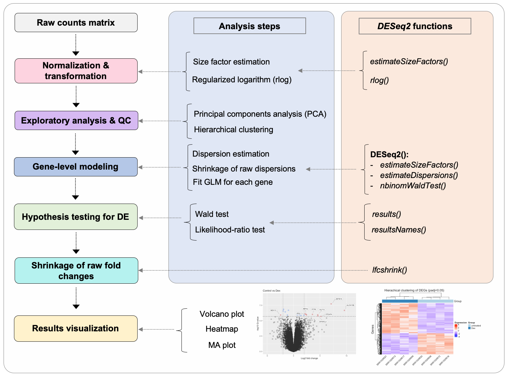
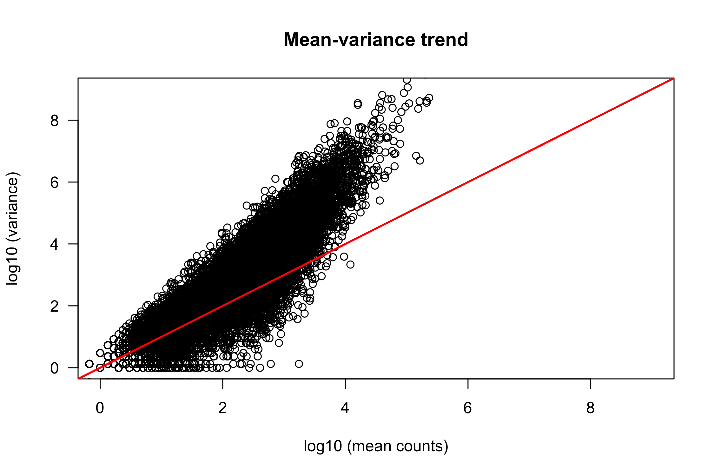
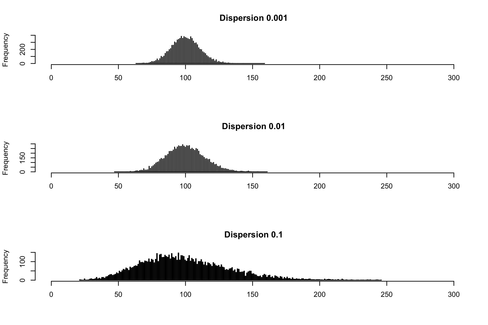
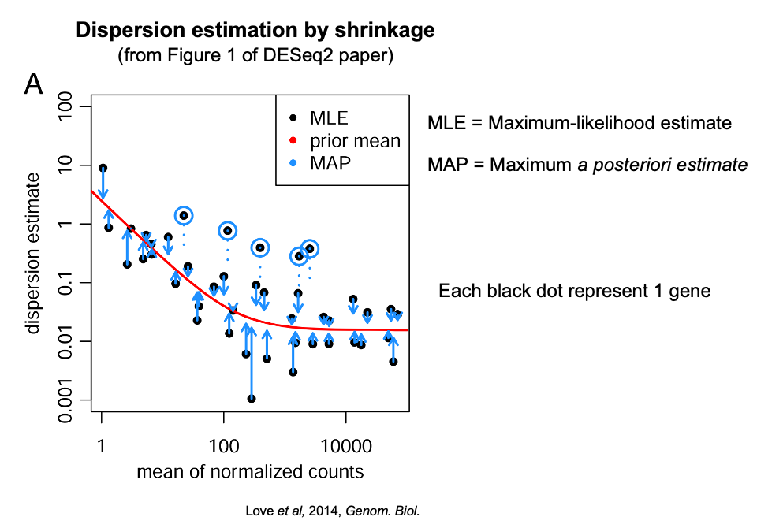
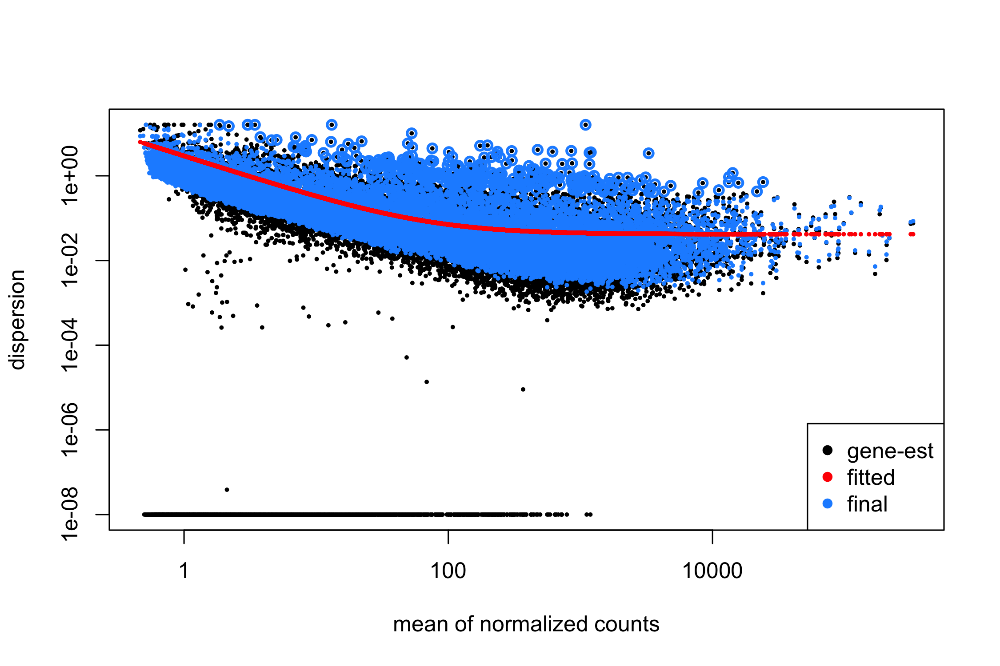
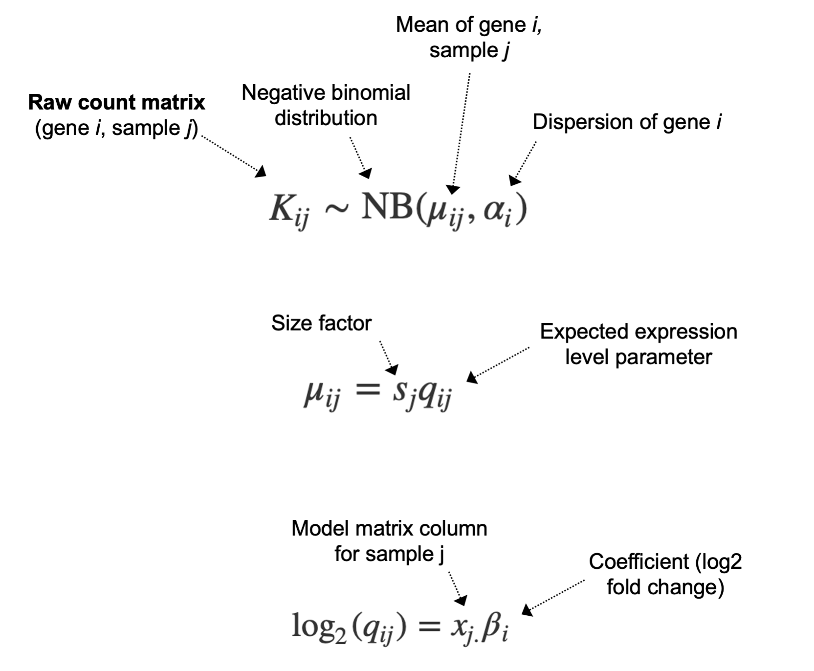
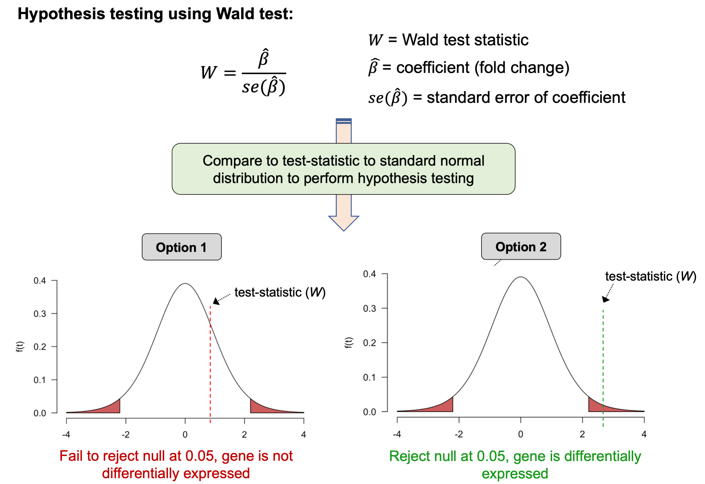
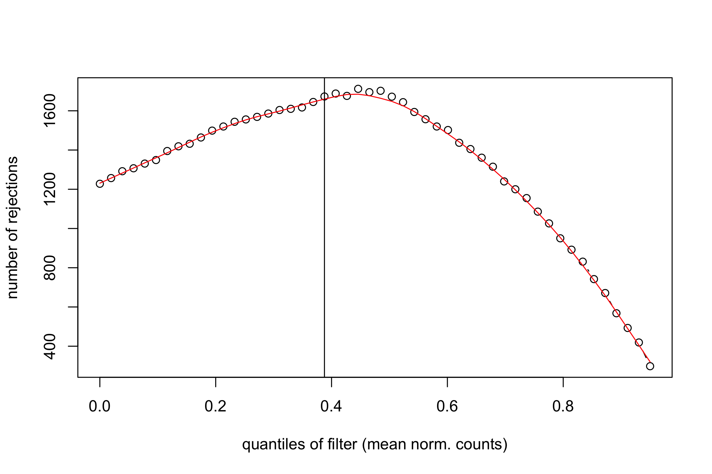

# Differential expression analysis in R

### Learning objectives:
- Gain an understanding for the basic characteristics of RNA-seq data, and which distributions we use to model them
- Gain an understanding for the models we apply to RNA-seq data in DESeq2 in order to test for differential expression
- Learn how to perform a differential expression analysis in DESeq2


### Set-up

Load required R-packages:
```r
library(DESeq2)
```

Load the DESeq2 dataset we already generated:
```r
# set working directory (YOU MAY NEED TO CHANGE THIS PATH)
setwd('~/Documents/GitHub/RNA-seq-Differential-Expression-workshop-June-2021/')

# load DESeq dataset
dds <- readRDS("DESeq2.rds")
```

### Introduction

Our exploratory data analysis indicated that Control and Dexamethasone treated samples cluster together respectively, suggesting consistent gene expression profiles between the replicates within conditions. In contrast, Alb and co-treated samples did not cluster by treatment, suggesting less consistency between replicates within conditions.

Based on these observations, a DE analysis of Control vs Dex is likely to have the most statistical power, therefore we will focus on this comparison in the following analysis. The image below highlights the main steps that will be involved in the DE analysis, and the functions that perform these steps in `DESeq2`.

<p align="center">

</p>

----------------------

### Part 1: Perform the Differential Expression analysis

DESeq2 provides the function `DEseq()`, which acts as a wrapper for several other functions that perform specific steps of the DE analysis.

**The main functions wrapped into `DESeq2` are:**  
- Estimation of size factors (`estimateSizeFactors()`)  
- Estimation of dispersion (`estimateDispersions`)  
- Fitting of the generalized linear model (GLM) and testing of wald statistics (`nbinomWaldTest`)

These functions can be run independently, however the `DESeq()` function provides a convenient way to perform the differential analysis in one step.

Run `DESeq2` on our dataset:
```r
# run the DEseq2 analysis
dds <- DESeq(dds)
```

Clearly, a lot is done for you by `DESeq()`. In order to understand what this function is doing under the hood and why, we need to understand the basic characteristics of RNA-seq data.

------------

### Part 2: Characteristics of RNA-seq data

Just like any other data type, its is important to understand the basic distribution before performing any analysis, so that we can select an appropriate statistical model for the data. DESeq2 fits models to the raw count data, therefore we should check the distribution of these counts.

Plot a histogram of raw counts:
```r
hist(counts(dds, normalized=FALSE)[,5],
     breaks = 500, col="blue",
     xlab="Raw expression counts",
     ylab="Number of genes",
     main = "Count distribution for sample X")
```

<p align="center">

</p>

As is obvious from the histogram, most genes have very low count values, with relatively few demonstrating higher expression levels. This plot highlights the extremely large dynamic range of RNA-seq data.

Importantly, the data is obviously **not** normally distributed, therefore any statistical model based on the normal distribution (e.g. t-test) is not appropriate for DE testing. By looking again at the matrix of raw counts, it is clear that RNA-seq is integer count data, therefore we should use a statistical model for count-based data.

Look at the head of the raw counts data again:
```r
head(counts(dds, normalized=FALSE))
```

One commonly used distribution for count data is [Poisson
distribution](https://en.wikipedia.org/wiki/Poisson_distribution), a discrete distribution which measures the probability of a given number of events happening in a specific interval. For example, what is the probability of observing 124 reads for gene X in an RNA-seq dataset.   

Importantly, the Poisson distribution assumes `mean == variance`. `mean` and `variance` in the context of biological count data are defined as follows:
- `mean` - the average count of a gene across replicates
- `variance` - the average deviation from the mean across replicates

To see if our RNA-seq data meets this assumption (and we should apply a poisson distribution), we can plot the `mean` vs the `variance` for a set of replicates in our dataset:

```r
# calculate mean and variance for group of replicates
mean_counts <- apply(counts(dds, normalized=FALSE)[,1:3], 1, mean)
variance_counts <- apply(counts(dds, normalized=FALSE)[,1:3], 1, var)

# plot the mean variance trend
plot(log10(mean_counts), log10(variance_counts),
     ylim=c(0,9), xlim=c(0,9),
     ylab = "log10 (mean counts)", xlab = "log10 (variance)",
     main = "Mean-variance trend", las = 1)

# add line for x=y
abline(0,1,lwd=2,col="red")
```

<p align="center">

</p>

If `mean == variance` for all genes, we would expect to see the points distributed across the red x=y line, however this is obviously not the case. At high read counts, the variance tends to be > than the mean, a feature referred to in statistics as **overdispersion**.

Additionally, we see there is more difference between the variances of genes with low counts than at high counts. Therefore, the variance is dependent upon the mean, a quality referred to as **heteroscadicity**.

-------

### Part 3: Modeling RNA-seq data

RNA-seq data clearly violate the key assumption of the poisson distribution `mean == variance`, therefore we use an alternate distribution that accounts for **overdispersion**. One solution is to use a generalization of the *Poisson distribution* called the **negative-binomial (NB) distribution** which includes a **dispersion parameter** that describes the amount the variance exceeds the mean for genes of a particular expression level.

We can plot a few randomly generated NB distributions with different dispersions to examine how the dispersion parameter affects the spread of the data.

```r
# set the plotting window to 3 rows and 1 column
par(mfrow=c(3,1))

### dispersion = 0.001
hist(rnbinom(n = 10000, mu = 100, size = 1/0.001),
     xlim = c(0, 300), xlab = "", breaks = 500,
     main = " Dispersion 0.001")

### dispersion = 0.01
hist(rnbinom(n = 10000, mu = 100, size = 1/0.01),
     xlim = c(0, 300), xlab = "", breaks = 500,
     main = " Dispersion 0.01")

### dispersion = 0.1
hist(rnbinom(n = 10000, mu = 100, size = 1/0.1),
     xlim = c(0, 300), xlab = "", breaks = 500,
     main = " Dispersion 0.1")
```

<p align="center">

</p>

> This example for plotting NB distributions was adapted from the *Data Analysis for the Life Sciences series* available on edX and at
[rafalab](https://rafalab.github.io/pages/harvardx.html), and is an excellent resource to learn more about how we model RNA-seq data for differential expression analysis.

Clearly, as the dispersion parameter increases, variation around the mean also increases. To model RNA-seq data using the negative binomial distribution, we must therefore estimate a dispersion parameter for each gene in the dataset.

The mean, variance, and dispersion are linked by the equation:

`variance = mean + dispersion x 2 mean-squared ( var = mu + disp. * mu^2)`

In order to accurately model differential expression for the genes in our dataset, `DESeq2` uses this equation to obtain estimates for the dispersion of each gene within each sample group (e.g. Control and Dex separately).

In particular, DESeq uses the function `estimateDispersions()` to calculate the dispersion estimates, however this function is called by the wrapper function `DESeq()` therefore we generally do not need to use it directly.

>NOTE: If we use the Poisson distribution instead of the negative binomial, we will fail to correctly estimate the per gene variability, leading to an increase in false positives in our DE analysis.

#### Shrinkage of dispersion estimates

One issue with the approach described above is that when the number of replicates is small (e.g. 3-5 in a typical RNA-seq experiment) the raw estimates of dispersion will be inaccurate. If we use these low accuracy raw dispersion estimates for differential expression testing, we will generate false positive results.

To improve the raw gene-level estimates of dispersion, `DESeq2` uses a statistical procedure called **empirical bayes** to *‘shrink’* these initial dispersion estimates toward a *‘prior’* mean, which is calculated by fitting a curve to the initial dispersion estimates based on their associated means, as seen in the figure below (from the DESeq2 paper):



**Two major factors control the magnitude of the shrinkage for each dispersion estimate:**
1. the number of samples in the group under consideration (more replicates -> less shrinkage)  
2. how far the initial dispersion is from the prior mean

In the above dispersion plot, raw dispersion estimates are shrunk towards the *prior mean* (fitted curve in red) to a final MAP estimate. For dispersion estimates further away from the line, you can see that their estimates are shrunk more than those are are originally closer to the line. This procedure generates **more accurate estimates of dispersion** as it shares information across genes with similar expression levels.

#### Review dispersion estimates for your dataset

Based on the equation shown above that connects the mean, variance and dispersion, we expect the dispersion to decrease when the mean increases. If we do not see this trend in the dispersion estimates for our dataset, the negative binomial may be a poor fit for the data, and we may need to use another method to test DE.

Before performing a DE analysis, it is therefore important to check the relationship between the dispersion and the mean. This can be done using a *dispersion plot* which DESeq2 allows you to generate using the convenient function `plotDispEsts()`.

Plot the dispersion estimates for our dataset:
```r
# set the plotting window to 1 rows and 1 column
par(mfrow=c(1,1))

plotDispEsts(dds)
```

<p align="center">

</p>

Two features of the dispersion plot tell us that this is a well calibrated set of dispersion estimates:
to two features:
- the final estimates are well scattered around the fitted line
- the dispersion trend decreases with increasing mean expression.

If the dispersion plot showed more structure, we would be concerned that the model is not estimating dispersions well for our data, indicating something may be wrong with the dataset, e.g. outlier samples, a batch effect, low quality samples/data, potential contamination etc.

**Take home message on dispersion estimates:**   
Confirm your dispersion estimates are well calibrated before performing your DE analysis, as accurate estimation of dispersion is critical in controlling the false-positive rate in experiments with smaller sample sizes (i.e. most RNA-seq experiments)**.

------------------------------------------------------------------------


### Part 4: Hypothesis testing

Now that we know which distribution we will assume for our data, we are ready to begin fitting models and testing for differential expression.

In a previous lesson, we introduced **generalized linear models (GLM)**, a family of statistical models that generalize standard linear regression in two ways:  
- use of probability distributions other than the normal distribution
- use of a *link-function* that connects the expression values in the linear model to the experimental groups

Since we are are assuming our raw counts follow a negative-binomial (NB) distribution, the GLM we will fit is of the NB family of GLMs.

#### The DESeq2 model:

The formula shown below defines the GLM used for differential expression analysis in DESeq2, and is described in detail in the original [DESeq publication](https://genomebiology.biomedcentral.com/articles/10.1186/s13059-014-0550-8).

<p align="center">

</p>

Briefly, the main features of this model:
- the raw counts are modeled using a NB distribution with a fitted mean ,&mu;, and a gene-specific dispersion parameter, &alpha;

- The mean &mu; is derived from the expected expression level across samples, *q*, and the sample-specific scale factor, *s*, (to correct for library size & composition)

- Expected expression level across samples, *q*, is used to estimate the log2 fold change (&beta;) for each experimental group in design matrix, *x*

By fitting the model using the raw counts, dispersion estimates, and size factors for each gene, we obtain a set of **model coefficients** for each sample group, which can be interpreted as the **log2 fold-change** in expression for that gene between the baseline group and each comparison group.

This coefficient, and the confidence associated with it (the standard error) can be used in **hypothesis testing** to calculate a **P-value**. DESeq2 uses the *Wald-test* to perform hypothesis testing, with the null hypothesis that *the log2 fold-change between experimental groups for an individual gene is not significantly different from 0* (no change in expression). This process is depcited in the figure below.

<p align="center">

</p>

Summary of major steps:  
1. The *coefficient (log 2 fold-change)* is divided by the *standard
error*
2. Compare test-statistic to standard normal distribution to compute a P-value
3. Based on P-value, accept or reject the null

This procedure is performed for every gene in the dataset, so if we test 20,000 genes for differential expression, we will end up with 20,000 sets of coefficients and P-values.

In DESeq2, this testing procedure is implemented by `nbinomWaldTest()` which is called by the wrapper function `DESeq()` therefore we do not usually need to call it directly.

> **Note:** `DESeq2` can also implement a *likelihood ratio test* (LRT), which is used to compare expression across more than two groups. For example, if you collected samples over a range of time points and you wanted to test if gene expression changed significantly over these time points, you could use the LRT instead of the wald-test.


#### Extracting and processing the results

`DESeq2` already performed all of the steps for hypothesis testing using the wald-test for us when we ran the `DESeq2()` function. All we have to do is tell DESeq2 which results we want to look at, which can be done
using the `results()` function, and specifying the coefficients that we
want by using the `names` agument.

```r
# quickly check the available coefficients we could extract
resultsNames(dds)

# get results for DEG analysis (and order by Pval) by specifying design
res <- results(dds,
  name = "tx.group_Dex_vs_untreated",
  alpha = 0.05)

# check dminesions on tables
dim(head)

# print top of results table
head(res)
```

|                 | baseMean  | log2FoldChange | lfcSE     | stat      | pvalue    | padj      |
|-----------------|-----------|----------------|-----------|-----------|-----------|-----------|
| ENSG00000000003 | 816.7294  | -0.3774491     | 0.235263  | -1.604372 | 0.1086321 | 0.307043  |
| ENSG00000000419 | 542.5456  | 0.1941677      | 0.109805  | 1.768291  | 0.0770123 | 0.250298  |
| ENSG00000000457 | 242.0987  | 0.036744       | 0.106903  | 0.343714  | 0.7310615 | 0.876968  |
| ENSG00000000460 | 64.6222   | -0.0887878     | 0.27153   | -0.32699  | 0.7436752 | 0.883366  |
| ENSG00000000971 | 5961.1192 | 0.4356027      | 0.28725   | 1.51646   | 0.1294031 | 0.340899  |
| ENSG00000001036 | 1319.2329 | -0.2397616     | 0.1488    | -1.611296 | 0.1071152 | 0.304209  |

##### Column summary:
- `baseMean`: mean normalized count value over all samples
- `log2FoldChange`: log2 fold change estimate of expression between conditions
- `lfcSE`: standard error of the estimated log2 fold change
- `stat`: test-statistic
- `pvalue`: raw (unadjusted) P-value
- `padj`: Benjamini and Hochberg adjusted P-value

The results table is composed of 24,419 rows, 1 for each gene tested in our dataset, each with its own unique Ensembl gene identifier in the first column. The subsequent columns provide relevant details related to the hypothesis testing process, including the log2 fold change and P-value(s).

Currently, the results are ordered by the Ensembl gene identifier, however it would be more useful to have them ordered by statistical significance.

```r
# order by adj Pval
res_ord <- res[order(res$padj),]

# print top of results table
head(res_ord)
```
|                 | baseMean  | log2FoldChange | lfcSE     | stat      | pvalue    | padj      |
|-----------------|-----------|----------------|-----------|-----------|-----------|-----------|
| ENSG00000179094 | 879.1624  | 3.195512       | 0.52009   | 6.14416   | 8.04E-10  | 1.20E-05  |
| ENSG00000109906 | 427.5196  | 7.102329       | 1.263873  | 5.6195    | 1.92E-08  | 1.43E-04  |
| ENSG00000157613 | 2837.4644 | -0.977869      | 0.188368  | -5.19128  | 2.09E-07  | 6.45E-04  |
| ENSG00000179593 | 74.1106   | 9.607462       | 1.852989  | 5.18485   | 2.16E-07  | 6.45E-04  |
| ENSG00000182010 | 104.2058  | -1.897678      | 0.361016  | -5.25649  | 1.47E-07  | 6.45E-04  |
| ENSG00000134253 | 139.3307  | -1.965796      | 0.382335  | -5.14155  | 2.72E-07  | 6.77E-04  |

Now we can review the genes that are of most interest to us, that is, those with small adjusted p-values (most significant). Note the we sorted on the adjusted P-values column `padj`, NOT the raw P-values column `pvalue`. As discussed previously, we are conducting thousands of tests, and must correct for the multiple testing problem.

`padj` provides us with Benjamini and Hochberg adjusted P-values that are corrected for multiple testing. If we were to use the `pvalue` column to select differentially expressed genes, we would make many false-positive findings (type I errors).

We could also use the results table to get more detail on our results, for example, determine how many genes fall under particular significance thresholds.

```r
# quick check for how many DEGs with significance @ 5% level in either FC direction
sum(res$padj < 0.05, na.rm=TRUE)
sum(res$padj < 0.05 & res$log2FoldChange > 2, na.rm=TRUE)
sum(res$padj < 0.05 & res$log2FoldChange < -2, na.rm=TRUE)
```  

Other methods to control for multiple hypothesis testing can be applied using the `pAdjustMethod` argument in the `results()` function, such as the more conservative **Bonferonni** method.
```r
res <- results(dds,
                name = "tx.group_Dex_vs_untreated",
                alpha = 0.05,
		pAdjustMethod = "bonferroni")

# how many significant DEGs
sum(res$padj < 0.05, na.rm=TRUE)
```

As expected, the more conservative method leads to fewer statistically significant results at the same P-value threshold.

> Remember, P-value thresholds do not need to be set at 5% for every experiment, you can be more or less conservative dependning on the nature of your experiment.

---------


### Part 5: Independent filtering

You may have noticed above that the argument `na.rm=TRUE` was used in the `sum()` function calls above. This is required because the vector or adjusted P-values contains `NA` values.

Count how many NA values are present in the vector of adjusted P-values:
```r
table(is.na(res$padj))
```

These `NA`'s are generated as part of a process referred to in DESeq2 as **independent filtering**, which aims to select genes that have little or no chance of being expressed (mostly low expression genes), and exclude them from final testing for differential expression.

This is valuable as it means fewer genes are tested for DE, and we therefore need to correct for fewer multiple tests, improving our statistical power.

For example, consider the Bonferonni thresholds below, involving correction for different numbers of genes. Which has more statistical power to accept true positive?

```r
#threshold 1
0.05/10000

# threshold 2
0.05/20000
```

#### How does Independent filtering work?

DESeq2 uses an iterative process to find the expression level at which the maximum number of null hypothesis rejections occurs. DESeq2 then selects the expression quantile 1 standard deviation below this maximum, and filters any genes with mean counts below this threshold, reducing the number of tests that need to be corrected for.

Independent filtering can be visualized by plotting the number of rejections of the null hypothesis against mean counts, to help us understand at which mean count value DESeq2 chose to filter results.

```r
# look at independent filtering results table
metadata(res_ord)$filterNumRej

# plot number of rejections at specific quantiles
plot(metadata(res_ord)$filterNumRej,
     type="b", ylab="number of null hypoth. rejections",
     xlab="quantiles of filter (mean norm. counts)")

# add line connecting points together
lines(metadata(res_ord)$lo.fit, col="red")

# add vertical line at selected independent filtering threshold
abline(v=metadata(res_ord)$filterTheta)
```

<p align="center">

</p>

Any gene with a mean expression value below the red line (the mean count value 1 standard deviation below where the maximum number of rejections was obtained) will have their `padj` values set to NA, and discarded during multiple testing correction.

Its worth removing the genes assigned a `padj` value of `NA` due to independent filtering in order to make our lives easier processing the results downstream.
```r
res_ord <- res_ord[!is.na(res_ord$padj),]
```

Write the results to a `.csv` file (could alternatively be a text file) and save our DESeq2 object.
```r
write.csv(as.data.frame(res_ord), file = "DE_results.csv")

# save RDS object
saveRDS(dds, file = "DESeq2.rds")
```
