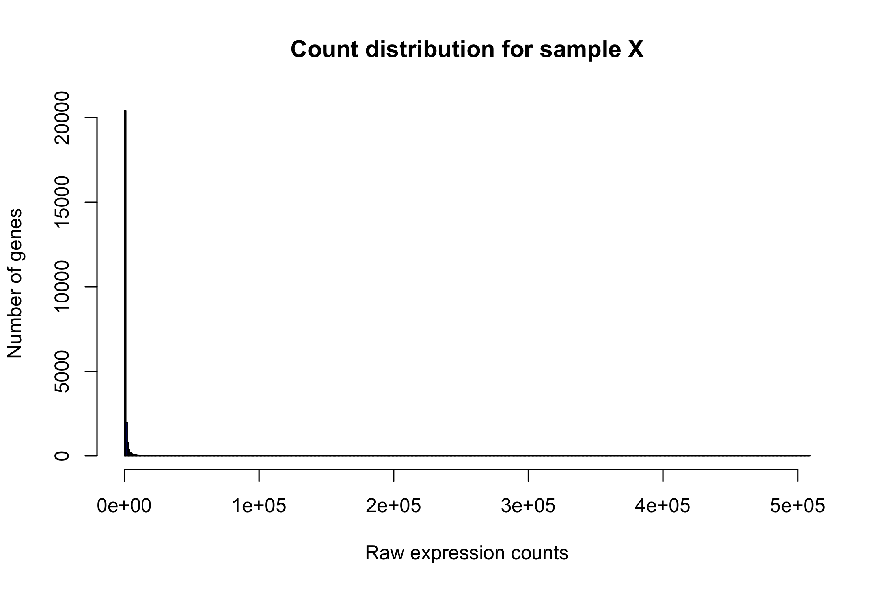

dispersion TO DO:
- reduce text and try add more images to improve flow
- remove/reduce content covered in statistical inference section (linear models, GLM principles etc.)


# Differential expression analysis in R

### Learning objectives:
-


### Set-up

Load required R-packages:
```r
library(DESeq2)
```

Load the DESeq2 dataset we already generated:
```r
dds <- readRDS("DESeq2.rdata")
```

### Introduction

Our exploratory data analysis indicated that Control and Dexamethasone treated samples cluster together, suggesting consistent gene expression profiles between the replicates. In contrast, Alb and co-treated samples did not cluster together, suggesting less consistency between replicates.

Based on these observations, a DE analysis of Control vs Dex is likely to have the most statistical power, therefore we will focus on this comparison in the following analysis. The image below highlights the main steps that will be involved in the DE analysis, and the functions that perform these steps in DESeq2.

<p align="center">

</p>

----------------------

### Part 1: Perform the Differential Expression analysis

DESeq2 provides the function `DEseq()`, which acts as a wrapper for several other functions that perform specific steps of the DE analysis.

**The main functions wrapped into `DESeq2` are:**  
- Estimation of size factors (`estimateSizeFactors()`)  
- Estimation of dispersion (`estimateDispersions`)  
- Fitting of the generalized linear model (GLM) and testing of wald statistics (`nbinomWaldTest`)

These functions can be run independently, however the `DESeq()` function provides a convenient way to perform the differential analysis in one step.

Run `DESeq2` on our dataset:
```r
# run the DEseq2 analysis
dds <- DESeq(dds)
```

Clearly, a lot is done for you by `DESeq()`. In order to understand what this function is doing under the hood and why, we need to understand the basic characteristics of RNA-seq data.

------------

### Part 2: Characteristics of RNA-seq data

Just like any other data type, its is important to understand the basic distribution before performing any analysis, so that we can select an appropriate statistical model for the data. DESeq2 fits models to the raw count data, therefore we should check the distribution of these counts.

Plot a histogram of raw counts:
```r
hist(counts(dds, normalized=FALSE)[,5],
     breaks = 500, col="blue",
     xlab="Raw expression counts",
     ylab="Number of genes",
     main = "Count distribution for sample X")
```
<p align="center">

</p>

As is obvious from the histogram, most genes with very low count values, with relatively few demonstrating higher expression levels. This plot highlights the extremely large dynamic range of RNA-seq data.

Importantly, the data is obviously **not** normally distributed, therefore any statistical model based on the normal distribution (e.g. t-test) is not appropriate for DE testing. By looking again at the matrix of raw counts, it is clear that RNA-seq is integer count data, therefore we should use a statistical model for count-based data.

Look at the head of the raw counts data again:
```r
head(counts(dds, normalized=FALSE))
```

One commonly used distribution for count data is [Poisson
distribution](https://en.wikipedia.org/wiki/Poisson_distribution), a discrete distribution which measures the probability of a given number of events happening in a specific interval. For example, what is the probability of observing 124 reads for gene X in an RNA-seq dataset.   

Importantly, the Poisson distribution assumes `mean == variance`. `mean` and `variance` in the context of biological count data are defined as follows:
- `mean` - the average count of a gene across replicates
- `variance` - the average deviation from the mean across replicates

To see if our RNA-seq data meets this assumption, we can plot the `mean` vs the `variance` for a set of replicates in our dataset:

```r
# calculate mean and variance for group of replicates
mean_counts <- apply(counts(dds, normalized=FALSE)[,1:3], 1, mean)
variance_counts <- apply(counts(dds, normalized=FALSE)[,1:3], 1, var)

# plot the mean variance trend
plot(log10(mean_counts), log10(variance_counts),
     ylim=c(0,9), xlim=c(0,9),
     ylab = "log10 (mean counts)", xlab = "log10 (variance)",
     main = "Mean-variance trend", las = 1)

# add line for x=y
abline(0,1,lwd=2,col="red")
```

<p align="center">

</p>

If `mean == variance` for all genes, we would expect to see the points distributed across the red x=y line, however this is obviously not the case. At high read counts, the variance tends to be > than the mean, a feature referred to in statistics as **overdispersion**.

Additionally, we see there is more difference between the variances of genes with low counts than at high counts. Therefore, the variance is dependent upon the mean, a quality referred to as **heteroscadicity**.

-------

### Part 3: Modeling RNA-seq data

RNA-seq data clearly violate the key assumption of the poisson distribution `mean == variance`, therefore we an alternate distribution that accounts for **overdispersion**. One solution is to use a generalization of the *Poisson distribution* called the **negative-binomial (NB) distribution** which includes a **dispersion parameter** that describes the amount the variance exceeds the mean for genes of a particular expression level.

We can plot a few randomly generated NB distributions with different dispersions to examine how the dispersion parameter affects the spread of the data.

```r
# set the plotting window to 3 rows and 1 column
par(mfrow=c(3,1))

### dispersion = 10
hist(rnbinom(n = 10000, mu = 100, size = 1/0.001),
     xlim = c(0, 300), xlab = "", breaks = 500,
     main = " Dispersion 0.001")

### dispersion = 10
hist(rnbinom(n = 10000, mu = 100, size = 1/0.01),
     xlim = c(0, 300), xlab = "", breaks = 500,
     main = " Dispersion 0.01")

### dispersion = 10
hist(rnbinom(n = 10000, mu = 100, size = 1/0.1),
     xlim = c(0, 300), xlab = "", breaks = 500,
     main = " Dispersion 0.1")
```

<p align="center">

</p>

> This example for plotting NB distributions was adapted from the *Data Analysis for the Life Sciences series* available on edX and at
[rafalab](https://rafalab.github.io/pages/harvardx.html), and is an excellent resource to learn more about how we model RNA-seq data for differential expression analysis.

Clearly, as the dispersion parameter increases, variation around the
mean also increases. To model RNA-seq data using the negative binomial distribution, we must therefore estimate a dispersion parameter for each gene in the dataset.

The mean, variance, and dispersion are linked by the equation:  
`variance = mean + dispersion x 2 mean-squared ( var = mu + disp. * mu^2)`

In order to accurately model differential expression for the genes in
our dataset, `DESeq2` uses this equation to obtain estimates for the
dispersion of each gene within each sample group (e.g. Control and Dex
separately).

>NOTE: If we use the Poisson distribution instead of the negative binomial, we will fail to correctly estimate the per gene variability, leading to an increase in false positives in our DE analysis.

#### Shrinkage of dispersion estimates

One issue with the approach described above is that when the number of replicates is small (e.g. 3-5 in a typical RNA-seq experiment) the raw estimates of dispersion will be inaccurate. If we use these low accuracy raw dispersion estimates for differential expression testing, we will generate false positive results.

To improve the raw gene-level estimates of dispersion, `DESeq2` uses
a statistical procedure called **empirical bayes** to *‘shrink’* these initial dispersion estimates toward a *‘prior’* mean, which is calculated by fitting a curve to the initial dispersion estimates based on their associated means, as seen in the figure below (from the DESeq2 paper):


**Two major factors control the magnitude of the shrinkage for each dispersion estimate:**
1. the number of samples in the group under consideration (more replicates -> less shrinkage)  
2. how far the initial dispersion is from the prior mean

In the above dispersion plot, raw dispersion estimates are shrunk towards the *prior mean* (fitted curve in red) to a final MAP estimate. For dispersion estimates further away from the line, you can see that their estimates are shrunk more than those are are originally closer to the line. This procedure generates **more accurate estimates of dispersion** as it
shares information across genes with similar expression levels.

#### Review dispersion estimates for your dataset

Based on the equation shown above that connects the mean, variance and dispersion, we expect the dispersion to decrease when the mean increases. If we do not see this trend in the dispersion estimates for our dataset, the negative binomial may be a poor fit for the data, and we may need to use another method to test DE.

Before performing a DE analysis, it is therefore important to check the relationship between the dispersion and the mean. This can be done using a *dispersion plot* which DESeq2 allows you to generate using the convenient function `plotDispEsts()`.

Plot the dispersion estimates for our dataset:
```r
plotDispEsts(dds)
```

<p align="center">

</p>

Two features of the dispersion plot tell us that this is a well calibrated set of dispersion estimates:
to two features:
- the final estimates are well scattered around the fitted line
- the dispersion trend decreases with increasing mean expression.

If the dispersion plot showed more structure, we would be
concerned that the model is not estimating dispersions well for our
data, indicating something may be wrong with the dataset, e.g. outlier
samples, a batch effect, low quality samples/data, potential
contamination etc.

**Take home message on dispersion estimates:**   
Confirm your dispersion estimates are well
calibrated before performing your DE analysis, as
accurate estimation of dispersion is critical in controlling the
false-positive rate in experiments with smaller sample sizes (i.e. most
RNA-seq experiments)**.

------------------------------------------------------------------------


### Part 4: Differential expression analysis - Hypothesis testing

Now that we understand how the dispersions are estimated, we are ready
to fit the data and test each gene for differential expression!

We fit the data using a **generalized linear model (GLM)**. GLM’s are a
family of statistical models that generalize standard linear regression
in two ways:  
- use of probability distributions other than the normal distribution -
the use of a *link-function* that links the expression values in the
linear model to the experimental groups, in a way that these other
distributions (such as the NB) can be used.

Since we are need to model our counts using the negative-binomial
distribution, the GLM we will fit is of the NB family of GLMs.

**The DESeq2 model:**


In order to fit the GLM, we need the **mean count of each gene** across
the samples in each experimental group, and the **dispersion of that
gene** in those groups. The mean count is a combination of the expected
expression level and the size factor, so that our model is corrected for **library size and composition**.

The process of fitting the model to the expression and dispersion values for each gene results in final set of **model coefficients** for each
sample group, which can be interpreted as the **log2 fold-change** in
expression for that gene between the baseline group and each comparison
group.

Each of the model coefficients has an associated **standard error**
associated with it, which we can use to calculate a **P-value** and
perform a process called **hypothesis testing**. Through hypothesis
testing we test the *null hypothesis* that the log2 fold-change between
experimental groups for an individual gene is not significantly
different from 0 (no change in expression).

**The default test used by `DESeq2` for hypothesis testing is the
*Wald-test*, which is implemented as follows: **  
1. The *coefficient (log 2 fold-change)* is divided by the *standard
error* (measure of statistical accuracy of the measurement).  
2. The resulting *Z-statistic* is compared to a standard normal
distribution (mean = 0, sd = 1) in order to compute a P-value.  
3. If the P-value is less than our pre-determined threshold for
significance, we reject the null hypothesis and accept the alternative,
that the gene is significantly DE.

**Note:** `DESeq2` can also implement a *likelihood ratio test* (LRT),
which is used to compare expression across more than two groups. For
example, if you collected samples over a range of time points and you
wanted to test if gene expression changed significantly over these time
points, you could use the LRT instead of the wald-test.

`DESeq2` already performed all of the steps for hypothesis testing using the wald-test for us when we ran the `DESeq2()` function. All we have to do is tell DESeq2 which results we want to look at, which can be done
using the `results()` function, and specifying the coefficients that we
want by using the `names` agument.

```r
# quickly check the available coefficients we could extract
resultsNames(dds)

## [1] "Intercept"          "group_Dex_vs_untreated"
## [3] "group_Alb_vs_untreated" "group_Alb_Dex_vs_untreated"

# get results for DEG analysis (and order by Pval) by specifying design
res <- results(dds,
  name = "group_Dex_vs_untreated",
  alpha = 0.05,
  lfcThreshold = 0)
```

**A couple of things to note here:**

-   `alpha` is set to 0.05 (5%) to correct the P-values for multiple
hypothesis testing (example with more detail on this coming up
below). By default, the “BH” method is used (Benjamini & Hochberg)
which controls the false discovery rate (FDR). Corrected P-values
are found in the `padj` column of the `results()` output, while the
uncorrected P-values are found in the `pvalue` column. Other methods
to control for multiple hypothesis testing can be specified using
the `pAdjustMethod` argument in the `results()` function, such as
the more conservative **Bonferonni** method.

-   `lfcThreshold` is set to 0, and is the default value. This tests the hypothesis that the log2 fold change values between our experimental
conditions are equal to 0. Different fold change values can be
specified, which can be useful if you observe a large number of
significantly differentially expressed genes with small fold
changes, and you want to restrict the test to the genes with the
largest differences (fold changes) between your conditions (we could
also achieve this by restricting the results to genes with
significant P-values AND have an absolute fold change &gt; a
specific threshold, however when we do this, the P-values loose some
of their meaning).


#### Note on P-values:

P-value thresholds **do not need to be set at 0.05** for every
experiment. You can be more or less stringent than this dependningh on
the nature of your experiment: if you want to be very conservative and
restrict your results to few results that are likely to be true
positives, you may wish to restrict the results to a more stringent
threshold. If your experiment is very preliminary and you care less
about capturing some false positives than missing true positives, you
may wish to relax your threshold.

**Additional note:** To extract the results, we could also use the
`contrast` argument in a similar way to how we used the `names` agument.
The first group specified to `contrast` is used as the numerator in
calculating the fold change, and the second group is used as the
denominator, therefore the second group is used as the baseline for the
comparison.

```r
res <- results(dds, alpha = 0.05,
  contrast = c("group", "Dex", "untreated"),
  lfcThreshold = 0)
```

This is useful when we have multiple levels in the experimental design
variable and we wish to extract coefficients for the results from
testing specific levels against one another. It is generally the same as using the `names` argument to extract coefficients, with some exceptions that are discussed in the DESeq2 documentation.

**Lets have a quick look at the results and how many genes were
statistically significant at an adjusted P-value threshold of 0.05. **

```r
# order by adj Pval
res_ord <- res[order(res$padj),]

# quick check for how many DEGs with significance @ 5% level in either FC direction
sum(res$padj < 0.05, na.rm=TRUE)

sum(res$padj < 0.05 & res$log2FoldChange>2, na.rm=TRUE)

sum(res$padj < 0.05 & res$log2FoldChange < -2, na.rm=TRUE)

```  

You may have noticed I am using `na.rm=TRUE` in the `sum()` function
above. Why might this be?

```r
table(is.na(res$padj))
```

This is not a mistake, but rather part of a deliberate filtering process conducted by `DESeq2`, in order to flag genes that have little or no change of being differentially expressed.

This is of value as it means we can correct for fewer total tests and
increase our statistical power to identify true positives.The three ways which `DESeq2` filters results are:  
- Genes with counts = 0 in all samples - Genes with extreme outliers
(determined using Cook’s distance) - *Independent filtering*
(identifying genes with low counts)

*Independent filtering*, DESeq2 carries out an iterative process where
it maximizes the value of the number of rejections over the quantiles of the mean normalized counts. Once the maximum number of rejections is
identified, DESeq2 will select the quantile of the normalized counts
that is 1 standard deviation below this maximum, and filter any results
with mean counts below this threshold. It is essentially a fancy (and
cool) way of reducing the number of tests we need to run.

We can plot the number of rejections of the null hypotesis against mean
counts, along with a vertical line, to help us understand at which mean
count value DESeq2 chose to filter results for. Any genes with a mean
expression value below this line will have their `padj` values set to
NA, and discarded during multiple testing correction.

```r
plot(metadata(res_ord)$filterNumRej,
     type="b", ylab="number of rejections",
     xlab="quantiles of filter (mean norm. counts)")
lines(metadata(res_ord)$lo.fit, col="red")
abline(v=metadata(res_ord)$filterTheta)
```

Its worth removing these results with NAs before moving forward to make
our lives a little easier when handling the adjusted P-values.

```r
    res_ord <- res_ord[!is.na(res_ord$padj),]
```

Write the results to a `.csv` file.
```r
write.csv(as.data.frame(res_ord), file = "DE_results.csv")
```


DESeq2 vs other approaches
