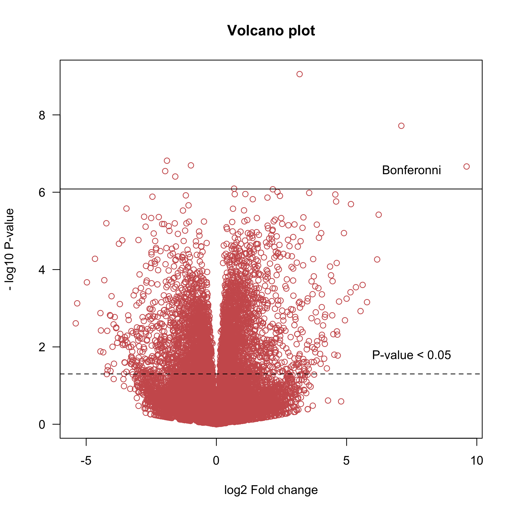
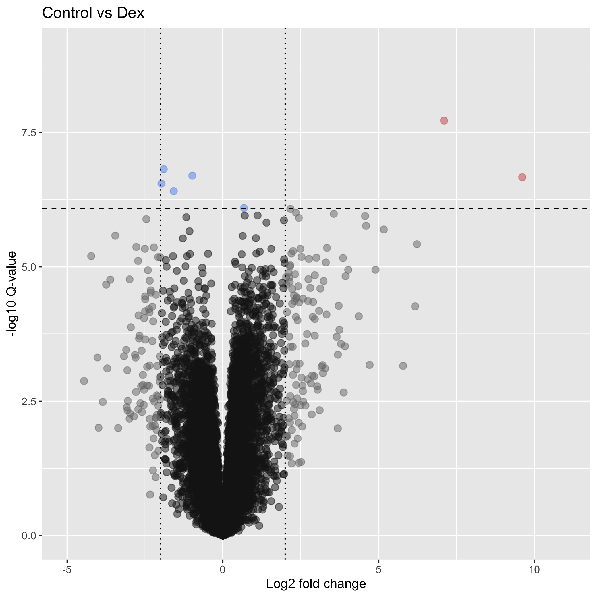

# Results annotation & visualization

### Learning objectives:
- Learn how to add annotations to differential expression results
- Create graphics to better understand the dynamics of differential expression in the comparison of interest

### Set-up


```r
library(vsn)
library(dplyr)
library(pheatmap)
library(gplots)
library(RColorBrewer)
library(ComplexHeatmap)
library(readr)
library(circlize)
library(EnhancedVolcano)
library(apeglm)
library(ggrepel)
```

-------

### Part 1: Gene annotation

To make our results interpretable, we need to add annotation data for each gene, e.g. symbol, genome coordinates, etc. Since we used *Ensembl v97* to annotate these data, we need to use the Ensembl v97 annotation data to annotate these results.

We can download the annotation file for our species of interest in a flat file format using the [BioMart on the Ensembl website](http://uswest.ensembl.org/biomart/martview/b0399bb192186dea3aedf87d82a4580c).

Download the file yourself and add it to the `data/` directory, or use the one we have provided for you.
```r
# read in the annotation file
anno <- read.delim("data/GRCh38.p12_ensembl-97.txt", stringsAsFactors = T, header = T)

# have a look at the first few rows
head(anno)

# order by Chromosome
anno <- anno[order(anno$Chromosome.scaffold.name),]

# have a look at the first few rows
head(anno)
```

Lets have a look at the distribution of features on each Chromosome:
```r
# generate a table counting number of each level of chromosome
tab1 <- table(anno$Chromosome.scaffold.name)
tab1[1:22]
```

Lets also quickly check that nothing is duplicated in the ENSG ID column of our annotation, as this would cause problems when merging with our results.

```r
any(duplicated(anno$Gene.stable.ID))
```

Now add the annotation for each gene name directly to the results.

```r
# use match() to find corresponding indices (rows) for each ENSG ID
mat1 <- match(rownames(res_ord), anno$Gene.stable.ID)

# check if any NAs exist
table(is.na(mat1))

# add gene names to results as a new column
res_ord$gene <- as.character(anno$Gene.name[mat1])

# look at the top 20 rows
head(res_ord, 20)
```

Add some additional columns that might be of interest to us when reviewing the results:
```r
res_ord$chr <- as.character(anno$Chromosome.scaffold.name[mat1])
res_ord$start <- as.character(anno$Gene.start..bp.[mat1])
res_ord$end <- as.character(anno$Gene.end..bp.[mat1])
res_ord$strand <- as.character(anno$Strand[mat1])

# look at first few rows
head(res_ord)
```

We've now added a lot of useful information to our results that will help us interpret them in more detail. We may also wish to restrict the table to only those results that were statistically significant (at a threshold of 5%).

```r
# subset @ 5% adjusted pval sig. level
res_order_FDR_05 <- res_ord[res_ord$padj<0.05,]
nrow(res_order_FDR_05)
```

Now write the table to a `.csv` file so that you can view it in other software (e.g. Excel) or share with others.  
```r
# write csv file for complete results
write.csv(as.data.frame(res_ord), file= "DE_results.csv")

# write csv for significant results
write.csv(as.data.frame(res_order_FDR_05), file="DE_results.FDR.0.05.csv")
```

----------------------

### Part 2: Visualization of Differential Expression

Several specific plot types exist that are useful for visualizing the results of a differential expression analysis, each providing insight on complimentary aspects of the results.

Below we will explore the major plot types useful for visualization of RNA-seq differential expression results, including:
- Volcano plots
- MA plots
- Heatmaps (hierachical clustering)

#### Volcano plot

Volcano plots contrast the **log2 fold change** (effect size) against the **-log10 P-value** (statistical significance). The ``-log10()`` of a really small number is a very large value, therefore any gene that has a very small *P*-value will appear higher up along the y-axis. In contrast, the `-log10` of 1 is equal to `0`, therefore genes with low statistical significance (*P*-values approaching 1) will appear lower down on the y-axis.

Similarly, genes with larger fold changes will appear further along the x-axis, in both directions. Genes with a positive fold change represent genes whose expression was greater in the baseline group (e.g. wild-type), while genes with a negative fold change represent genes whose expression was lower than in the baseline group.

> Note: The fold-change value of genes with non-significant fold changes is not meaningful, as there is not enough statistical confidence in these fold changes.

```r
plot(res$log2FoldChange, -log10(res$pvalue),
     main = "Volcano plot",
     las = 1, col = "indianred",
     ylab = "- log10 P-value", xlab = "log2 Fold change")

# add horizontal lines to help guide interpretation
abline(h=-log10(0.05/nrow(res)), lty = 1, col = "black") # Bonferonni
abline(h=-log10(0.05), lty = 2, col = "black") # nominal P-value
text(7.5, -log10(0.05/nrow(res))+0.5, "Bonferonni")
text(7.5, -log10(0.05)+0.5, "P-value < 0.05")
```

<p align="center">
  
</p>


Some genes are above the significance threshold in both the up- and down-regulation directions, but also have absolute log2 fold change values of at least 2 or more. Of particular interest, there seem to be a few genes with very large fold change values & -log10 P-values, making them especially interesting as their effect size is large AND our confidence in this fold change is good.

It is a hard to make specific inferences from this plot at the individual gene level, so some labels for interesting data points (and some colors) would definitely improve this volcano plot, and make it more informative. We will use the `ggpolot2` R package to do this, and we will color each point based on a combination of fold change and P-value, as these determine which genes are of most interest to us.

```r
# save a dataframe from the results() output
res_tmp <- as.data.frame(res_ord)

# add a column that will be used to save the colors we want to plot
res_tmp$cols <- c()

# set the significance cut off (alpha) and fold change threshold to be used for coloring of genes
alpha <- 0.05/nrow(res)
fc_cutoff <- 2

# loop through our dataframe and add values to the color column based on magnitude of alpha and LFCs
res_tmp$cols <- NA
for(i in 1:nrow(res_tmp)){
# if pvalue is NA don't assign a color - no plotting
if(is.na(res_tmp$pvalue[i])){
    res_tmp$cols[i] <- NA
}

# if pvalue is < alpha AND LFC is > FC cutoff color red
else if(res_tmp$pvalue[i]<=alpha & res_tmp$log2FoldChange[i] > fc_cutoff){
    res_tmp$cols[i] <- "indianred"
}

# if pvalue is < alpha AND LFC is < -FC cutoff color red
else if(res_tmp$pvalue[i]<=alpha & res_tmp$log2FoldChange[i] < -fc_cutoff){
    res_tmp$cols[i] <- "indianred"
}
# if pvalue is < alpha AND LFC is not within cut off value color blue
else if(res_tmp$pvalue[i]<=alpha & res_tmp$log2FoldChange[i]>-fc_cutoff & res_tmp$log2FoldChange[i]<fc_cutoff){
    res_tmp$cols[i] <- "cornflowerblue"
}
# if pvalue is > alpha AND LFC is > cut off value color gray
else if(res_tmp$pvalue[i]>alpha & res_tmp$log2FoldChange[i] > fc_cutoff){
    res_tmp$cols[i] <- "gray47"
}
# if pvalue is > alpha and LFC is < -cut off value color gray
else if(res_tmp$pvalue[i]>alpha & res_tmp$log2FoldChange[i] < -fc_cutoff){
    res_tmp$cols[i] <- "gray47"
}
# if pvalue is > alpha and LFC is not within cutoff values color light gray
else if(res_tmp$pvalue[i]>alpha & res_tmp$log2FoldChange[i] < fc_cutoff){
    res_tmp$cols[i] <- "gray10"
}
  }

res_tmp$ENSG <- rownames(res_tmp)

# generate the plot
p = ggplot(res_tmp, aes(log2FoldChange, -log10(pvalue))) +
    geom_point(aes(col=col), alpha = 0.5, size =2.5, colour = res_tmp$cols, fill = res_tmp$cols)  +
    xlab("Log2 fold change") + ylab("-log10 Q-value") +
    ylim(0, 9) +
    xlim(-5, 11) +
    geom_hline(yintercept = -log10(alpha), color = "black", linetype = "dashed", size = 0.4) +
    theme(legend.key = element_blank()) +
    ggtitle("Control vs Dex")
  # add vertical fold change lines
  geom_vline(xintercept = fc_cutoff, colour = "black", linetype="dotted") +
  geom_vline(xintercept = -fc_cutoff, colour = "black", linetype="dotted")

# print the plot
print(p)

```
<p align="center">
  
</p>

This is nice, but some labels for potentially interesting genes would be useful. Lets add some using the `ggrepel` package.

```r
p2 <- p +
  # add labels to genes w/ LFC > 2 and above alpha threshold
  geom_label_repel(data = subset(res_tmp, log2FoldChange > 2 & pvalue < alpha), aes(label = gene),
             box.padding   = 0.35,
             nudge_x = 0.1,
             nudge_y = 0.1,
             point.padding = 1,
             label.size = 0.1,
             segment.size = 0.3,
             segment.color = 'grey50', size = 3) +
  # add labels to genes w/ LFC < -2 and above alpha threshold
  geom_label_repel(data = subset(res_tmp, log2FoldChange < -2 & pvalue < alpha), aes(label = gene),
             box.padding   = 0.35,
             nudge_x = -0.1,
             nudge_y = 0.1,
             point.padding = 1,
             label.size = 0.1,
             segment.size = 0.3,
             segment.color = 'grey50', size = 3)

# print the plot
print(p2)
```

<p align="center">
  
</p>


This looks a lot better, and is more informative than the first  basic plot we generated.

> #### Replicates - Food for thought:
Detecting truly differentially expressed genes is dependent on the technical variance between your replicates. If the technical variance is high, you generally need a large fold-change to achieve statistical significance. The more replicates you have, the more you are able to reduce the technical variance, increasing statistical power, and enabling you to confidently detect differential expression of smaller fold changes. For example, for an experiment where there are 300 truly differentially expressed genes between your conditions, you may detect 200 of these with 3 replicates, while you may detect 250 with 5 replicates.


-----------------------

#### MA plots

The MA-plot contrasts gene expression levels against log2 fold change values, allowing us to identify high, low, or medium genes expression genes that were differential across the experimental conditions.

In a typical experiment, we expect to see DEGs across most of the range of expression values, therefore the MA plot is also a useful quality control instrument. To highlight genes that were significantly DE, any gene with an adjusted *P*-value of &lt; 0.05 (or whatever threshold is set) is colored in blue.

The `DESeq2` package has a useful function `plotMA` that will generate this plot for you from a `DESeq` class object.
```r
plotMA(res_ord, ylim=c(-6,6), main = "Raw Log2 Fold change")
```

<p align="center">
  
</p>

Statistically significant DE genes are detected across the full range of expression values (x-axis), which is a good indicator that our differential expression model has was appropriate and worked well.

Furthermore, a handful of genes with medium to high expression values can be seen that ALSO have large LFC values. These genes potentially represent the most interesting findings, because they had the largest difference between the experimental conditions.

If we wanted to identify these genes in our results table at specific thresholds, we could apply an approach like the example provided below:
```r
# subset for significant results, w/ absolute LFC > 2, exp. mean > 1e3
res_ord_sub <- res_ord[res_ord$padj < 0.05 &
                       abs(res_ord$log2FoldChange) > 2 &
                       res_ord$baseMean > 1e3, ]
```

#### Empirical Bayes shrinkage of log2 FCs

The log2 fold-change plotted above is the raw LFC value estimated by the generalized linear model. However, as we discussed above, the individual estimates of variance or dispersion for a single gene are often unreliable, and this holds true `log2 foldchange` also.

To obtain more confident LFC estimates, `DESeq2` performs a statistical procedure that involves **shrinking the raw fold change estimates toward zero** for genes that are less likely to contain reliable or highly important information.

This is done in a very similar way to the shrinkage using **empirical bayes** that we discussed for the dispersion estimates, and penalizes (shrinks more) LFC based on 2 major factors:
- low count values  
- high dispersion (& thus reduced confidence in expression levels)

DESeq2 provides a function `lfcShrink()` that must be implemented separately of the standard workflow implemented using `DESeq2()`.

```r
# calculate shrunken fold change estimate
res_shrink <- lfcShrink(dds,
         coef=paste0(resultsNames(dds)[which(resultsNames(dds)=="tx.group_Dex_vs_untreated")]),
         type="apeglm")
```

After performing the shrinkage procedure, we compare the raw and shrunken LFCs to assess the impact of shrinkage:

```r
# set the plotting window to 2 rows and 1 column
par(mfrow=c(2,1))

# plot the raw FC estimates
plotMA(res_ord, ylim=c(-6,6), main = "Raw Log2 Fold change")

# plot the shrunken estimates
plotMA(res_shrink, ylim=c(-6,6), main = "Shrunken Log2 Fold change")
```
<p align="center">
  
</p>

Comparing to the raw LFCs, **majority of genes with lower expression values have had their LFCs shrunk toward zero**. Conceptually, genes with low counts can easily generate a large LFC since only a few extra counts represent a substantial proportional difference between two small numbers. Consequently, these fold-changes are unlikely to be accurate as they are based of few reads, so we don’t want to prioritize their importance by giving them a large LFC, and instead shrink them toward 0.

It’s always good to review the shrunken estimates, to confirm that you don’t have many DEGs with very small count values. If you do, you may want to look at the expression levels for those genes to investigate these findings in more detail.

Alternatively, as expression levels increase, it is evident from the MA plot that the level of shrinkage is generally less, and more genes are identified as significant. The higher expression level of these genes means more data is available to calculate the LFC, so we can be more confident about these results.

> **Note:** This shrinkage does not substantially affect hypothesis testing, therefore is performed independently. The shrunk log fold change values are more valuable for prioritizing your results further, visual inspection, or functional analysis (e.g. gene ontology/pathway analysis).

---------------------------

#### Heatmaps - (Hierarchical clustering)

As we discussed in the exploratory analysis lesson, heatmaps are a useful way to visualize the results of clustering analyses, such as *unsupervised hierarchical clustering*.

Genes that are significantly differentially expressed between experimental conditions are by definition informative features about the differences between those groups. It is therefore common to perform clustering analysis using only the genes identified as differentially expressed, and visualize these results using a heatmap.

Similarly to as we did in the exploratory analysis lesson, we use the matrix of `rlog` transformed values, and limit this to only those genes present in the significant results table `res_order_FDR_05`. We then subject these data to unsupervised hierarchical clustering and visualize on a heatmap.

```r
# take the regularized log
rld <- rlog(dds, blind = FALSE)

#isolate samples from groups of interest
ind_to_keep <- c(which(colData(rld)$group=="untreated"), which(colData(rld)$group=="Dex"))

# set up gene expression matrix
mat1 <- assay(rld)[rownames(res_order_FDR_05), ind_to_keep]

# scale matrix by each col. values
mat_scaled = t(apply(mat1, 1, scale))

# set up colors for heatmap
col = colorRamp2(c(-3, 0, 3), c("blue", "white", "red"))
cols1 <- brewer.pal(11, "Paired")

# subset coldata for samples in untx and ex groups
colData_sub <- colData(dds)[ind_to_keep, ]

# set up annotation bar for samples
ha1 = HeatmapAnnotation(Group = colData_sub$group,
            col = list(Group = c("untreated" = cols1[1], "Dex" = cols1[2])),
                   show_legend = TRUE)

# se up column annotation labels (samples)
ha = columnAnnotation(x = anno_text(colData_sub$SRR,
                    which="column", rot = 45,
                    gp = gpar(fontsize = 10)))

# generate heatmap object
ht1 = Heatmap(mat_scaled, name = "Expression", col = col,
          top_annotation = c(ha1),
          bottom_annotation = c(ha),
          show_row_names = FALSE,
          show_column_names = FALSE)

# plot the heatmap
draw(ht1, row_title = "Genes", column_title = "Hierachical clustering of DEGs (padj<0.05)")
```
<p align="center">
  
</p>

The differentially expressed genes clearly differentiate the untreated samples from the Dex treated samples. Importantly, we can see how many genes are expressed at greater levels in the Dex treated samples than in the untreated, and vice versa.
