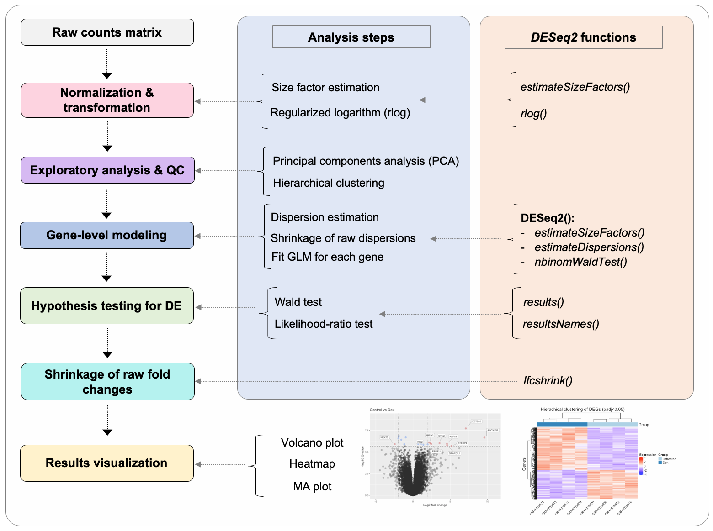
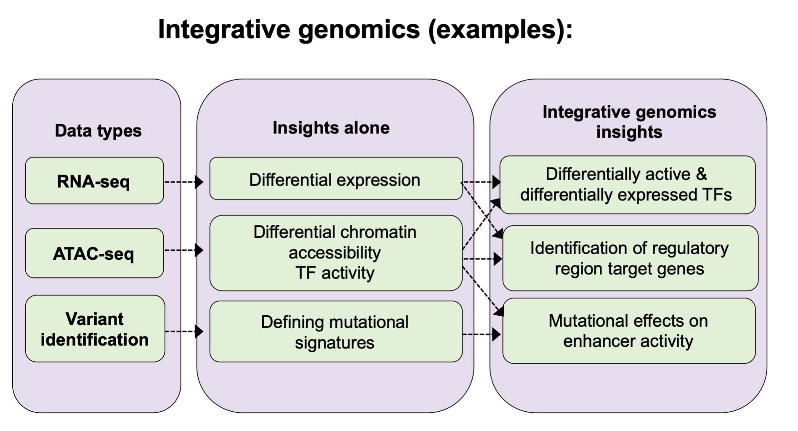
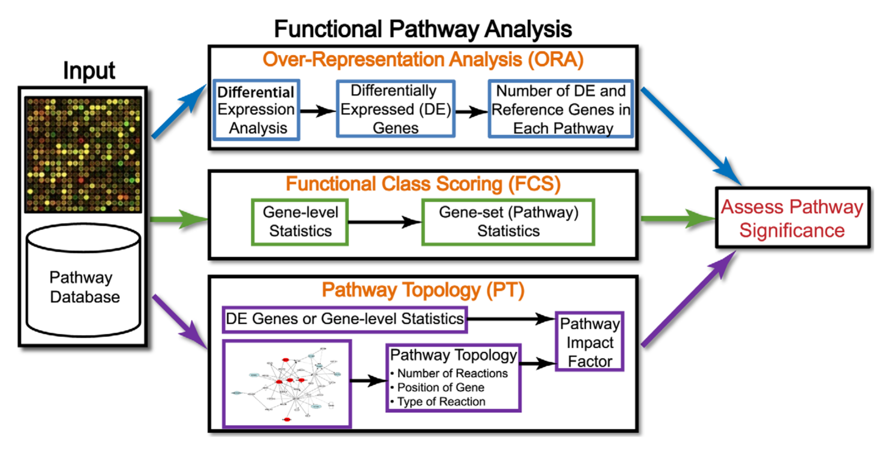

# Closing remarks

## Workshop goals:
- Understand the basic principles of a differential expression (DE) analysis using RNA-seq data
- Develop a working understanding of the fundamental statistics fro typical DE analysis methods
- Perform a DE analysis using R/Bioconductor packages
- Learn how to explore the results and make robust insights from your data

----------

## DE analysis overview

----------

## Final take-aways from the workshop
- Spend the time to plan your experiment well (enough replicates, appropriate sequencing depth, etc.). No analysis can rescue a bas dataset.

- If you will perform differential expression analysis regularly, you should build your experience in R, as well as you knowledge of fundamental statistical concepts

- Make sure you understand what the core functions (e.g. `DESeq2`) are doing by consulting the original manuscripts documentation. Failure to understand what these functions do may lead you to perform your analysis incorrectly.

- Correct for multiple testing!

----------

## How to consolidate your learning:
- Revisit the workshop materials a week or two after the workshop, and re-run the analysis code from scratch

- Edit/annotate the code, run sub-sections, and read the `help` pages for important functions

- Read the methods sections of published papers that perform differential expression analyses. This will help you to understand how many of the concepts we have discussed are applied and reported in practice

- Read reviews like [this one](https://pubmed.ncbi.nlm.nih.gov/31341269/) from Stark *et al*, 2019, *Nat. Rev. Genetics*, `RNA Sequencing: The Teenage Years`.

- Ask us questions! (Bioinformatics office hours: https://dartmouth.zoom.us/s/96998379866, Friday's at 1-2 pm, password: *bioinfo*)

----------

## Post DE analysis

After completing a DE analysis, we are usually left with a handful of genes that we wish to extract further meaning from. Depending on our hypothesis and what data is available to us, there are several ways to do this.

### 1. Integrative genomics

If you also collected other genomic data of a different modality ion the same samples (e.g. WGS-/WES, ChIP-seq, ATAC-seq), or an appropriate public dataset exists, you may choose to integrate your DE results with these data. This approach is referred to as *integrative genomics* and allows you to make insights that you would be unable to with a single data type.

For example, if you collected ChIP-seq for a specific transcription factor (TF) with paired RNA-seq data, you may wish to use your significant DEGs to identify genes whose expression is turned on/off by this TF under a treatment condition.

  

### 2. Gene ontology (GO) & pathway analyses
Unless very few significant DEGs were identified in your analysis, it can be difficult to extract biological insights from a long list of genes. GO and pathway analysis methods represent a diverse collection of approaches that seek to prioritize sets of functionally related genes that are enriched in a list of DEGs.

  

Many tools and methodologies exist for performing GO & pathway enrichment analysis. These tools make use of varied statistical approaches, some of which were designed for specific applications (such as for microarray data, not RNA-seq, e.g. GSEA), therefore selecting the most appropriate tool for your analysis can be non-trivial. We encourage you to read more about these methods and review your analysis plan with an expert if you plan to use these in you research.

Some suggested reading regarding gene ontology and pathway analysis approaches:  
- [Gene set analysis approaches for RNA-seq data: performance evaluation and application guideline. *Briefings in Bioinformatics.* 2016.](https://doi.org/10.1093/bib/bbv069)

- [Ten Years of Pathway Analysis: Current Approaches and Outstanding Challenges. *PLoS Computational Biology.* 2012.](https://doi.org/10.1371/journal.pcbi.1002375)

- [Gene set enrichment analysis: a knowledge-based approach for interpreting genome-wide expression profiles. *PNAS* 2005.](https://doi.org/10.1073/pnas.0506580102) (the original GSEA paper)

- [Gene Set Enrichment Analysis Made Simple. *Stat Methods Med Red.* 2009.](https://www.ncbi.nlm.nih.gov/pmc/articles/PMC3134237/)

-----------

## Feedback

We ask that you complete the survey that will be sent out over email so that we can gauge what worked well, and what we need to improve for the future. If you have additional thoughts that were not addressed in the survey, please feel free to contact any one of us, or reach out to the DAC email directly (*DataAnalyticsCore@groups.dartmouth.edu*).

This workshop will be offered again, in addition to our other bioinformatics workshop offerings (details will be posted on [CQB website](https://sites.dartmouth.edu/cqb/)). If you have suggestions for workshops you would like to see, please let us know!

---------

## Bioinformatics office hours & consultations

Please reach out to us with questions related to content from this workshop, or for analysis consultations. We also host **bioinformatics office hours** on **Fridays 1-2pm** for general questions and inquiries (currently on Zoom: https://dartmouth.zoom.us/s/96998379866, password: *bioinfo*)

### Now.... Discussion/question time!
