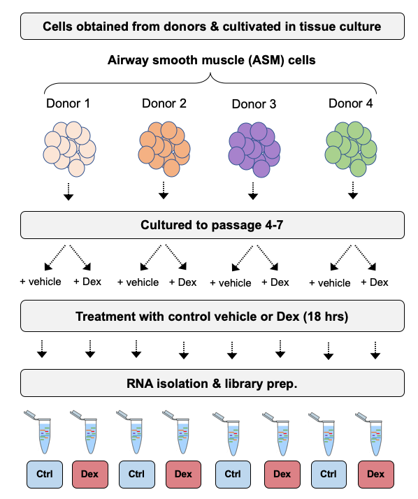

# Welcome & set-up instructions #

Welcome to the Data Analytics Core (DAC) bulk RNA-seq differential expression analysis workshop. Before you attend the workshop, we ask that you familiarize yourself with the dataset we will be using, and install the software we will be using.

-------------

## The Dataset ##

For this workshop we will be using a published dataset as part of a study to determine the effects of Glucocorticoid drugs of human airway smooth muscle cells ([published in PLoS One](https://journals.plos.org/plosone/article?id=10.1371/journal.pone.0099625)). In the study, four cell lines were treated with either a control vehicle (untreated), dexamethasone (dex), albuterol (alb), or both dexamethasone and albuterol (co-treated) for 18 hours before transcriptomes were extracted.

The cartoon below provides an overview of the experimental design:

<p align="left">

</p>

The raw data was downloaded from the [Sequence Read Archive, SRA ](https://www.ncbi.nlm.nih.gov/sra?) a large NCBI database of high-throughput sequencing (HTS) data, and processed to generate a gene expression matrix of raw counts. These data are available under SRA accession [SRP033351](https://www.ncbi.nlm.nih.gov/sra?term=SRP033351).

Normalized data are also available from the [Gene Expression Omnibus (GEO)](https://www.ncbi.nlm.nih.gov/geo/), another NCBI database, used to store processed HTS datasets, under accession [GSE52778](https://www.ncbi.nlm.nih.gov/geo/query/acc.cgi?acc=GSE52778).


-------------

## Install R & RStudio

### R
For all the analysis in the workshop, we will be using R, a free open source programming language and statistical software environment used extensively in bioinformatics. R is also a powerful way to create high quality graphics.

Visit the *R-Project* homepage [here](https://www.r-project.org/) and download a R version (4.0.3 or greater) that is appropriate for your operating system.

<p align="left">

</p>

### RStudio

To help use R efficiently, we will also be using [RStudio](https://rstudio.com/), an IDE (Integrated Development Environment) for R built to consolidate different aspects of writing, executing, and evaluating computer code. Without an IDE, these aspects of programming would need to be performed in different applications,  reducing productivity.  

<p align="left">

</p>

**Basic features of the RStudio IDE include:**  
- console for submitting code to
- syntax-highlighting editor used for writing R-scripts
- windows for environment management, data visualization, and debugging
- facilities for version control & project management

Navigate to the [RStudio website](https://rstudio.com/) and download the appropriate version for your operating system.


-------------

## Install required R-packages

Beyond the basic functionality included in R's standard distribution, an enormous number of packages designed to extend R's functionality for specific applications an exist, representing one of R's core strengths.

Most R-packages are obtained from one of two package repositories:
- [CRAN (The Comprehensive R Network)](https://cran.r-project.org/)
- [Bioconductor](https://www.bioconductor.org/)

During the workshop we will be using a number of packages from both CRAN and Bioconductor. Once you have installed R and RStudio, open RStudio (or R) and copy & paste the following code chunk into the console. This will prompt R to download and install the specified packages.

```r
if (!any(rownames(installed.packages()) == "tximport")){
  if (!requireNamespace("BiocManager", quietly = TRUE))
      install.packages("BiocManager")
  BiocManager::install("tximport")
}
library(tximport)

if (!any(rownames(installed.packages()) == "DESeq2")){
  if (!requireNamespace("BiocManager", quietly = TRUE))
      install.packages("BiocManager")
  BiocManager::install("DESeq2")
}
library(DESeq2)

if (!any(rownames(installed.packages()) == "biomaRt")){
  if (!requireNamespace("BiocManager", quietly = TRUE))
      install.packages("BiocManager")
  BiocManager::install("biomaRt")
}
library(biomaRt)

if (!any(rownames(installed.packages()) == "vsn")){
  if (!requireNamespace("BiocManager", quietly = TRUE))
      install.packages("BiocManager")
  BiocManager::install("vsn")
}
library(vsn)

if (!any(rownames(installed.packages()) == "ComplexHeatmap")){
  if (!requireNamespace("BiocManager", quietly = TRUE))
      install.packages("BiocManager")
  BiocManager::install("ComplexHeatmap")
}
library(ComplexHeatmap)

if (!any(rownames(installed.packages()) == "readr")){
      install.packages("readr")
}
library(readr)

if (!any(rownames(installed.packages()) == "ggrepel")){
      install.packages("ggrepel")
}
library(ggrepel)

if (!any(rownames(installed.packages()) == "rlang")){
  if (!requireNamespace("BiocManager", quietly = TRUE))
      install.packages("BiocManager")
  BiocManager::install("rlang")
}
library(rlang)

if (!any(rownames(installed.packages()) == "EnhancedVolcano")){
  if (!requireNamespace("BiocManager", quietly = TRUE))
      install.packages("BiocManager")
  BiocManager::install("EnhancedVolcano")
}
library(EnhancedVolcano)

if (!any(rownames(installed.packages()) == "apeglm")){
  if (!requireNamespace("BiocManager", quietly = TRUE))
      install.packages("BiocManager")
  BiocManager::install("apeglm")
}
library(apeglm)

if (!any(rownames(installed.packages()) == "dplyr")){
  if (!requireNamespace("BiocManager", quietly = TRUE))
      install.packages("BiocManager")
  BiocManager::install("dplyr")
}
library(dplyr)

if (!any(rownames(installed.packages()) == "ggplot2")){
  if (!requireNamespace("BiocManager", quietly = TRUE))
      install.packages("BiocManager")
  BiocManager::install("ggplot2")
}
library(ggplot2)

if (!any(rownames(installed.packages()) == "pheatmap")){
  if (!requireNamespace("BiocManager", quietly = TRUE))
      install.packages("BiocManager")
  BiocManager::install("pheatmap")
}
library(pheatmap)

if (!any(rownames(installed.packages()) == "gplots")){
  if (!requireNamespace("BiocManager", quietly = TRUE))
      install.packages("BiocManager")
  BiocManager::install("gplots")
}
library(gplots)

if (!any(rownames(installed.packages()) == "RColorBrewer")){
  if (!requireNamespace("BiocManager", quietly = TRUE))
      install.packages("BiocManager")
  BiocManager::install("RColorBrewer")
}
library(RColorBrewer)

if (!any(rownames(installed.packages()) == "circlize")){
  if (!requireNamespace("BiocManager", quietly = TRUE))
      install.packages("BiocManager")
  BiocManager::install("circlize")
}
library(circlize)

sessionInfo()
```

#### Troubleshooting

If one of the packages fails to install correctly due to the absence of another package that is not installed by the above code chunk, simply install the missing package, then re-run the failed code from above.

- If the missing package is from the CRAN repository, use `install.packages(XXX)`.

- If the missing package is from Bioconductor, use `  BiocManager::install("XXX")`.

If you are unable to resolve the issue, please reach out to us for assistance **before** the workshop at DataAnalyticsCore@groups.dartmouth.edu.
